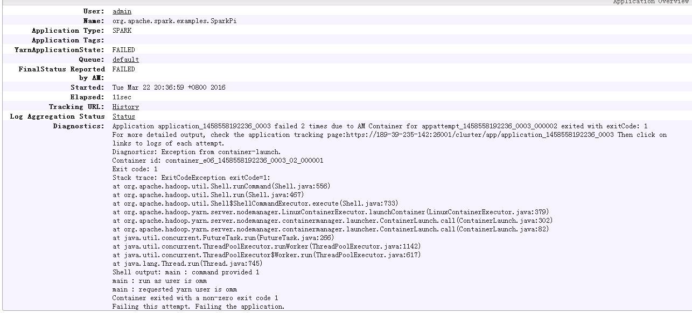

# Yarn-cluster模式下，Can't get the Kerberos realm异常<a name="mrs_03_0110"></a>

## 问题背景与现象<a name="zh-cn_topic_0167276133_sec17e362e6c844a08c01a7aadd6d2f1b"></a>

认证异常导致提交Spark任务失败。

## 原因分析<a name="zh-cn_topic_0167276133_sc0d0c38af5a446df993e9aa270b09cae"></a>

1.  在driver端打印异常找不到连接hdfs的token，报错如下：

    ```
    16/03/22 20:37:10 WARN Client: Exception encountered while connecting to the server : org.apache.hadoop.ipc.RemoteException(org.apache.hadoop.security.token.SecretManager$InvalidToken): token (HDFS_DELEGATION_TOKEN token 192 for admin) can't be found in cache
    16/03/22 20:37:10 WARN Client: Failed to cleanup staging dir .sparkStaging/application_1458558192236_0003
    org.apache.hadoop.ipc.RemoteException(org.apache.hadoop.security.token.SecretManager$InvalidToken): token (HDFS_DELEGATION_TOKEN token 192 for admin) can't be found in cache
    ```

2.  在Yarn原生页面显示am启动两次均失败，任务退出，如[图1](#zh-cn_topic_0167276133_fig2694147172519)信息：

    **图 1**  am启动失败<a name="zh-cn_topic_0167276133_fig2694147172519"></a>  
    

3.  查看ApplicationMaster日志看到如下异常信息：

    ```
    Exception in thread "main" java.lang.ExceptionInInitializerError
    Caused by: org.apache.spark.SparkException: Unable to load YARN support
    Caused by: java.lang.IllegalArgumentException: Can't get Kerberos realm
    Caused by: java.lang.reflect.InvocationTargetException
    Caused by: KrbException: Cannot locate default realm
    Caused by: KrbException: Generic error (description in e-text) (60) - Unable to locate Kerberos realm
    org.apache.hadoop.hive.metastore.MetaStoreUtils.newInstance(MetaStoreUtils.java:1410)
    ... 86 more
    Caused by: javax.jdo.JDOFatalInternalException: Unexpected exception caught.
    NestedThrowables:java.lang.reflect.InvocationTargetException
    ... 110 more
    ```

4.  执行**./spark-submit --class yourclassname --master yarn-cluster /yourdependencyjars**任务以yarn-cluster模式提交任务，driver端会在集群中启用，由于加载的是客户端的spark.driver.extraJavaOptions，在集群节点上对应路径下找不到对应的kdc.conf文件，无法获取kerberos认证所需信息，导致am启动失败。

## 解决办法<a name="zh-cn_topic_0167276133_section27565344155035"></a>

在客户端提交任务时，在命令行中配置自定义的spark.driver.extraJavaOptions参数这样任务运行时就不会自动加载客户端路径下spark-defaults.conf中的spark.driver.extraJavaOptions；或者在启动spark任务时，通过--conf来指定driver的配置，如下（此处spark.driver.extraJavaOptions“=“号后面的引号部分不能缺少）。

**./spark-submit -class yourclassname --master yarn-cluster --conf spark.driver.extraJavaOptions="**

**-Dlog4j.configuration=file:/opt/client/Spark/spark/conf/log4j.properties -Djetty.version=x.y.z -Dzookeeper.server.principal=zookeeper/hadoop.794bbab6\_9505\_44cc\_8515\_b4eddc84e6c1.com -Djava.security.krb5.conf=/opt/client/KrbClient/kerberos/var/krb5kdc/krb5.conf -Djava.security.auth.login.config=/opt/client/Spark/spark/conf/jaas.conf -Dorg.xerial.snappy.tempdir=/opt/client/Spark/tmp -Dcarbon.properties.filepath=/opt/client/Spark/spark/conf/carbon.properties" ../yourdependencyjars**

