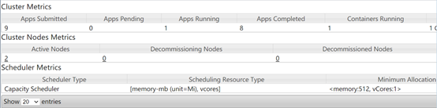
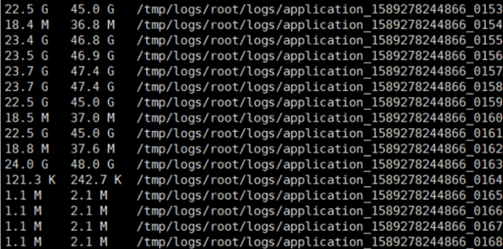
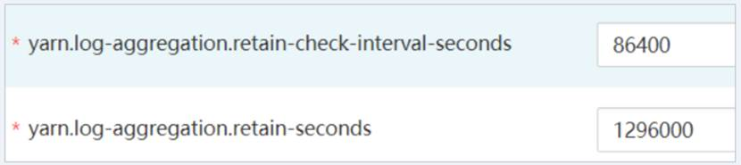

# Yarn汇聚日志过大导致磁盘被占满

## 用户问题

集群的磁盘使用率很高。

## 问题现象

-   Manager管理页面下主机管理显示磁盘使用率过高。
-   Yarn WebUI界面上显示只有少量任务在运行。

    

-   登录到集群的Master节点执行**hdfs dfs -du -h / **命令发现如下文件占用大量磁盘空间。

    

-   Yarn服务的汇聚日志配置如下

    

## 原因分析

客户提交任务的操作过于频繁，且聚合后的日志文件被删除的时间配置为1296000，即聚合日志保留15天，导致汇聚的日志无法在短时时间内释放，从而引起磁盘被占满。

## 处理步骤

1.  登录Manager页面。
    -   MRS Manager界面操作：登录MRS Manager，选择“服务管理 \> Yarn \> 服务配置 \> 全部配置”。
    -   FusionInsight Manager界面操作：登录FusionInsight Manager，选择“集群 \> 服务 \> Yarn \> 配置 \> 全部配置”。

2.  搜索“yarn.log-aggregation.retain-seconds”参数，并根据实际情况将yarn.log-aggregation.retain-seconds调小，比如调整为： 259200，即Yarn的聚合日志保留3天，到期后自动释放磁盘空间。
3.  保存配置，不勾选“重新启动受影响的服务或实例”。
4.  在业务空闲时执行该步骤重启Yarn服务，重启Yarn服务会导致上层服务业务中断，影响集群的管理维护和业务，建议在空闲时执行。
    1.  登录Manager页面。
    2.  重启Yarn服务。

