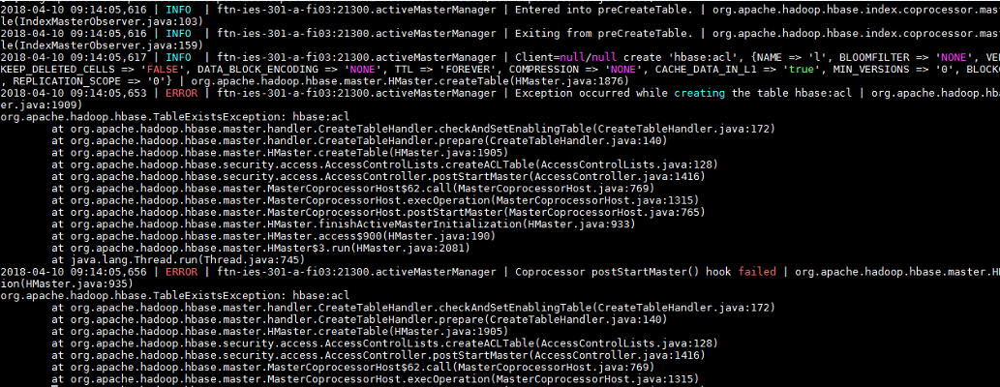
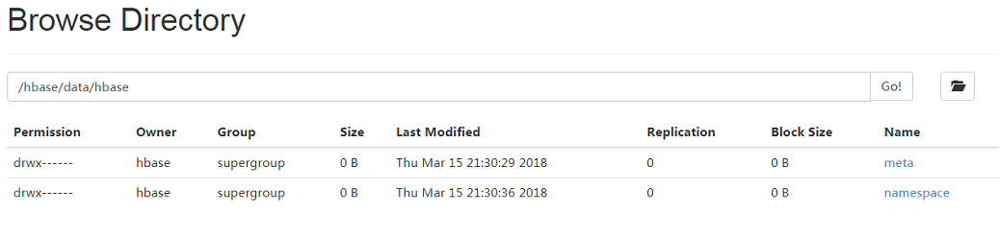

# acl表目录丢失导致HBase启动失败<a name="mrs_03_0145"></a>

## 问题背景与现象<a name="zh-cn_topic_0167275766_sf76e408f8ea44020bf3de33c280bc079"></a>

集群HBase启动失败

## 原因分析<a name="zh-cn_topic_0167275766_s2d857902554344b38f9d1ff9130b2ce3"></a>

1.  查看HBase的HMaster日志，报如下错误：

    

2.  检查HDFS上HBase的路径发现acl表路径丢失。

    


## 解决办法<a name="zh-cn_topic_0167275766_section1455043221018"></a>

1.  停止HBase组件。
2.  在HBase客户端使用hbase用户登录认证，执行如下命令。

    例如：

    ```
    hadoop03:~ # source /opt/client/bigdata_env
    hadoop03:~ # kinit hbase
    Password for hbase@HADOOP.COM: 
    hadoop03:~ # hbase zkcli
    ```

3.  删除zk中acl表信息。

    例如：

    ```
    [zk: hadoop01:24002,hadoop02:24002,hadoop03:24002(CONNECTED) 0] deleteall /hbase/table/hbase:acl
    [zk: hadoop01:24002,hadoop02:24002,hadoop03:24002(CONNECTED) 0] deleteall /hbase/table-lock/hbase:acl
    ```

4.  启动HBase组件。

