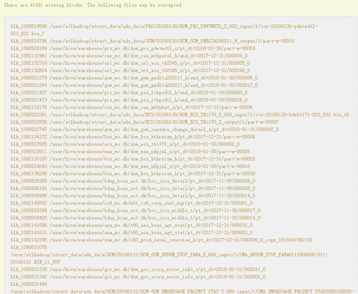
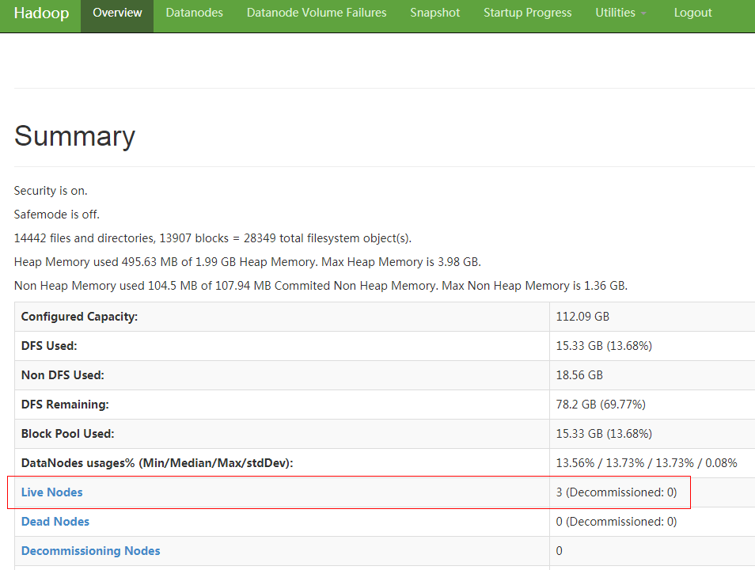
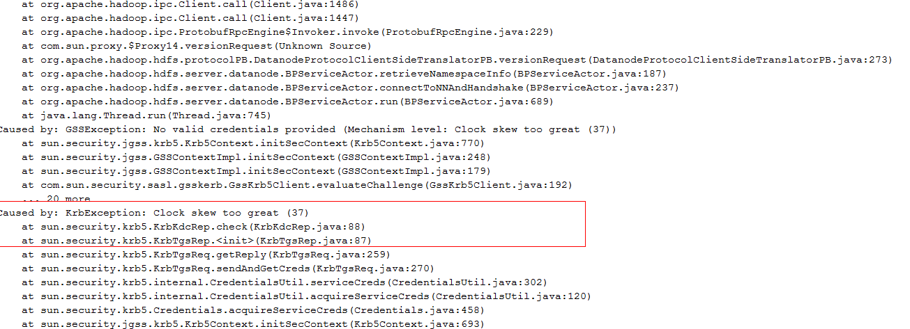

# ntpdate修改时间导致HDFS出现大量丢块

## 问题背景与现象

1.  用ntpdate修改了集群时间，修改时未停止集群，修改后HDFS进入安全模式，无法启动。
2.  退出安全模式后启动，hfck检查丢了大概1T数据。

## 原因分析

1.  查看NameNode原生页面发现有大量的块丢失。

    **图 1**  块丢失  
    

2.  查看原生页面 Datanode Information 发现显示的DataNode节点数和实际的相差10个节点

    **图 2**  查看DataNode节点数  
    

3.  查看DateNode运行日志“/var/log/Bigdata/hdfs/dn/hadoop-omm-datanode-主机名.log”，发现如下错误信息

    重要错误信息 Clock skew too great

    **图 3**  DateNode运行日志错误  
    

## 解决办法

1.  修改在原生页面查看不到的10数据节点的时间。
2.  在MRS Manager页面重启对应的DataNode实例。

