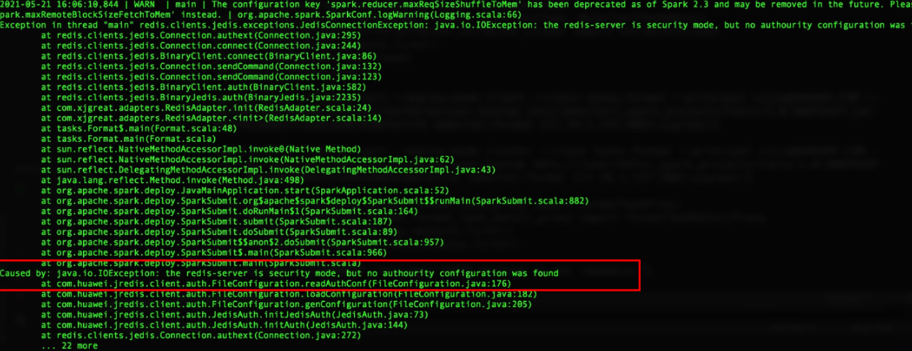

# spark连接redis报错

## 用户问题

使用MRS 3.x版本安全集群的spark组件访问redis报错。

## 问题现象

使用MRS\_3.0版本安全集群的spark组件访问redis，会出现如下错误：

## 原因分析

Spark的jars目录下有一个MRS集群自带的jredisclient-xxx.jar包，客户使用spark任务连接redis的时候会因为加载了这个包从而出现该错误，需要手动去除redisclient包即可。

## 处理步骤

1.  清理Spark客户端下的jar包。

    **cd $SPARK\_HOME/jars**

    **mv jredisclient-\*.jar /tmp**

2.  清理Spark服务端下的jar包。

    分别登录SparkResource2x所在的节点\(一般有两个\)。

    **mkdir /tmp/SparkResource2x**

    **cd /opt/Bigdata/FusionInsight\_Current/1\_\*\_SparkResource2x/install/spark/jars/**

    **mv jredisclient-\*.jar /tmp/SparkResource2x**

3.  清理HDFS上面的jredisclient文件。
    1.  查看$SPARK\_HOME/conf/spark-defaults.conf里面的配置项spark.yarn.archive，获取spark-archive-2x.zip包的地址。

        **cat $SPARK\_HOME/conf/spark-defaults.conf | grep "spark.yarn.archive"**

    2.  下载spark-archive-2x.zip包（本指导以MRS 3.0.5版本为例，具体命令请根据实际集群版本修改）。

        **cd /opt**

        **mkdir sparkTmp**

        **cd sparkTmp**

        **hdfs dfs -get hdfs://hacluster/user/spark2x/jars/8.0.2.1/spark-archive-2x.zip**

    3.  解压spark-archive-2x.zip文件，并删除原文件。

        **unzip spark-archive-2x.zip**

        **rm -f spark-archive-2x.zip**

    4.  移除jredisclient包。

        **rm -f jredisclient-\*.jar**

    5.  重新压缩spark-archive-2x.zip包。

        **zip spark-archive-2x.zip ./\***

    6.  备份原有压缩包，上传新的压缩包。

        **hdfs dfs -mv hdfs://hacluster/user/spark2x/jars/8.0.2.1/spark-archive-2x.zip /tmp**

        **hdfs dfs -put spark-archive-2x.zip hdfs://hacluster/user/spark2x/jars/8.0.2.1/spark-archive-2x.zip**

    7.  新的spark-archive-2x.zip中已删除jredisclient文件，需要重启JDBCServer服务，防止JDBCServer服务异常。
    8.  清除临时文件。

        **rm -rf /opt/sparkTmp**

