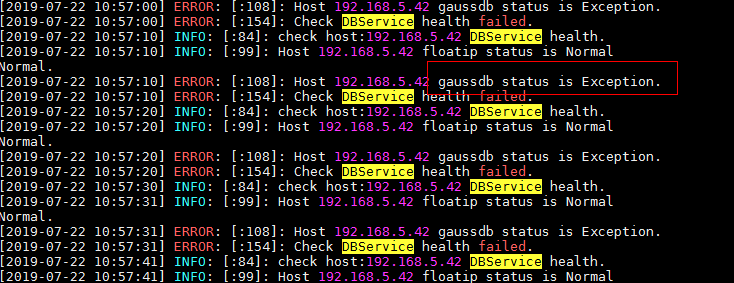

# /tmp目录权限不对导致DBserver实例状态一直处于Restoring

## 问题背景与现象

DBServer实例状态一直是Restoring状态，重启之后仍然不恢复。

## 原因分析

1.  查看“/var/log/Bigdata/dbservice/healthCheck/dbservice\_processCheck.log“，可以看到gaussdb异常。

    **图 1**  gaussdb异常  
    

2.  检查发现“/tmp“权限不对。

    **图 2**  /tmp权限  
    

## 解决办法

1.  修改/tmp的权限。

    **chmod 1777 /tmp**

2.  等待实例状态恢复。

