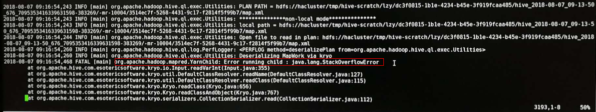

# 任务执行中报栈内存溢出导致任务执行失败<a name="mrs_03_0190"></a>

## 问题背景与现象<a name="zh-cn_topic_0167275960_section842971116813"></a>

Hive执行查询操作时报错**Error running child : java.lang.StackOverflowError**，具体报错信息如下：

```
FATAL [main] org.apache.hadoop.mapred.YarnChild: Error running child : java.lang.StackOverflowError
at org.apache.hive.come.esotericsoftware.kryo.io.Input.readVarInt(Input.java:355)
at org.apache.hive.come.esotericsoftware.kryo.util.DefautClassResolver.readName(DefautClassResolver.java:127)
at org.apache.hive.come.esotericsoftware.kryo.util.DefautClassResolver.readClass(DefautClassResolver.java:115)
at org.apache.hive.come.esotericsoftware.kryo.Kryo.readClass(Kryo.java.656)
at org.apache.hive.come.esotericsoftware.kryo.kryo.readClassAnd0bject(Kryo.java:767)
at org.apache.hive.come.esotericsoftware.kryo.serializers.collectionSerializer.read(CollectionSerializer.java:112)
```



## 原因分析<a name="zh-cn_topic_0167275960_section724010302087"></a>

java.lang.StackOverflowError这是内存溢出错误的一种，即线程栈的溢出，方法调用层次过多（比如存在无限递归调用）或线程栈太小都会导致此报错。

## 解决办法<a name="zh-cn_topic_0167275960_section33171970911"></a>

通过调整mapreduce阶段的map和reduce子进程JVM参数中的栈内存解决此问题，主要涉及参数为mapreduce.map.java.opts（调整map的栈内存）和mapreduce.reduce.java.opts（调整reduce的栈内存），调整方法如下（以mapreduce.map.java.opts参数为例）。

-   临时增加map内存（只针对此次beeline生效）：

    在beeline中执行如下命令**set mapreduce.map.java.opts=-Xss8G;**（具体数值请结合实际业务情况进行调整）。


-   永久增加map内存mapreduce.map.memory.mb和mapreduce.map.java.opts的值：
    1.  进入Hive服务配置页面：
        -   MRS 1.8.10及之前版本，登录MRS Manager页面，具体请参见[访问MRS Manager](https://support.huaweicloud.com/usermanual-mrs/mrs_01_0102.html)，然后选择“服务管理 \> Hive \> 服务配置”，单击“基础配置”下拉菜单，选择“全部配置”。
        -   MRS 1.8.10之后及2._x_版本，单击集群名称，登录集群详情页面，选择“组件管理 \> Hive \> 服务配置”，单击“基础配置”下拉菜单，选择“全部配置”。

            > **说明：** 
            >若集群详情页面没有“组件管理”页签，请先完成IAM用户同步（在集群详情页的“概览”页签，单击“IAM用户同步“右侧的“单击同步”进行IAM用户同步）。

        -   MRS 3.x及后续版本，登录FusionInsight Manager，然后选择“集群 \>  _待操作的集群名_称 \> 服务 \> Hive \> 配置 \> 全部配置”。

    2.  在hiveserver自定义参数界面添加自定义参数mapreduce.map.java.opts及相应的值。
    3.  保存配置并重启受影响的服务或者实例。

        修改配置后需要保存，请注意参数在HiveServer自定义参数处修改，保存重启后生效（重启期间hive服务不可用），请注意执行时间窗口。


