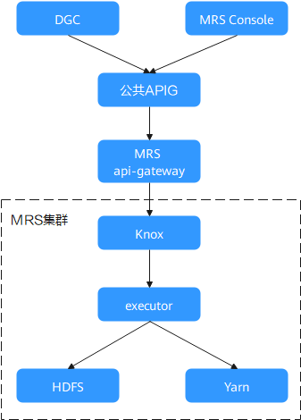
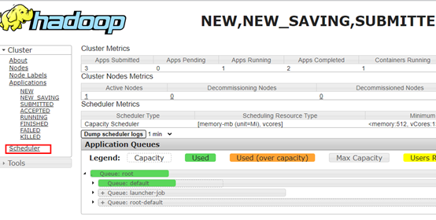
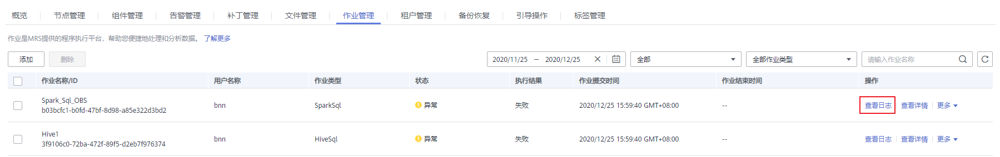
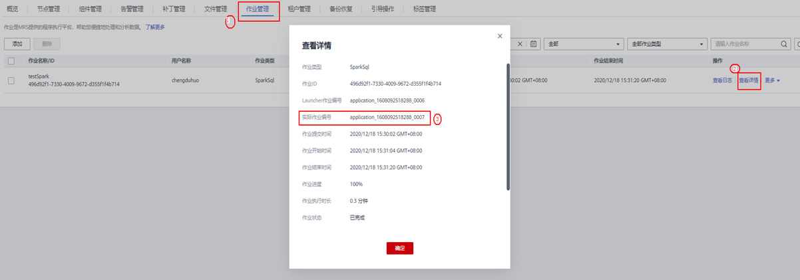
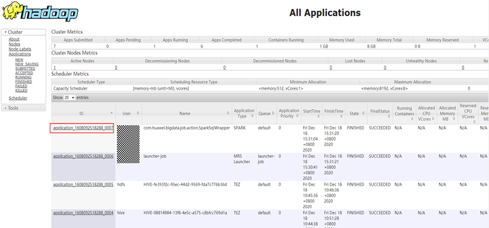
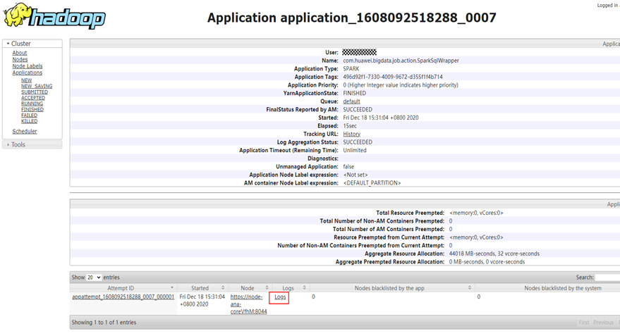

# 作业无法提交如何定位？

## 问题背景与现象

客户通过DGC或者在MRS Console无法提交作业。

## 问题影响

作业无法提交，业务中断。

## 作业流程简介

1.  所有请求会先经过APIG网关，受到APIG配置的流控限制。
2.  APIG将请求转发到MRS管控面的api-gateway中。
3.  MRS管控面API节点轮询主备oms的Knox，确认主oms的Knox。
4.  MRS管控面API提交任务到主oms的Knox。
5.  Knox转发请求到本节点的executor进程。
6.  executor进程提交任务到Yarn。

**图 1**  作业流程  

## 处理步骤

前期准备：

-   确定作业是通过DGC或在MRS Console提交。
-   准备如[表1](#table89854924219)信息。

    **表 1**  修复前准备事项

    
    <table><thead align="left"><tr id="row7561610134213"><th class="cellrowborder" valign="top" width="12.120000000000001%" id="mcps1.2.4.1.1">
序号

    </th>
    <th class="cellrowborder" valign="top" width="31.31%" id="mcps1.2.4.1.2">
项目

    </th>
    <th class="cellrowborder" valign="top" width="56.57%" id="mcps1.2.4.1.3">
操作方式

    </th>
    </tr>
    </thead>
    <tbody><tr id="row756161012428"><td class="cellrowborder" valign="top" width="12.120000000000001%" headers="mcps1.2.4.1.1 ">
1

    </td>
    <td class="cellrowborder" valign="top" width="31.31%" headers="mcps1.2.4.1.2 ">
集群账号信息

    </td>
    <td class="cellrowborder" valign="top" width="56.57%" headers="mcps1.2.4.1.3 ">
申请集群<strong id="b1356171013422">admin</strong>账户的密码。

    </td>
    </tr>
    <tr id="row15565103428"><td class="cellrowborder" valign="top" width="12.120000000000001%" headers="mcps1.2.4.1.1 ">
2

    </td>
    <td class="cellrowborder" valign="top" width="31.31%" headers="mcps1.2.4.1.2 ">
节点账号信息

    </td>
    <td class="cellrowborder" valign="top" width="56.57%" headers="mcps1.2.4.1.3 ">
申请集群内节点的<strong id="b856201015421">omm、root</strong>用户密码。

    </td>
    </tr>
    <tr id="row1656161024212"><td class="cellrowborder" valign="top" width="12.120000000000001%" headers="mcps1.2.4.1.1 ">
3

    </td>
    <td class="cellrowborder" valign="top" width="31.31%" headers="mcps1.2.4.1.2 ">
SSH远程登录工具

    </td>
    <td class="cellrowborder" valign="top" width="56.57%" headers="mcps1.2.4.1.3 ">
准备PuTTY或SecureCRT等工具。

    </td>
    </tr>
    <tr id="row175691012429"><td class="cellrowborder" valign="top" width="12.120000000000001%" headers="mcps1.2.4.1.1 ">
4

    </td>
    <td class="cellrowborder" valign="top" width="31.31%" headers="mcps1.2.4.1.2 ">
客户端

    </td>
    <td class="cellrowborder" valign="top" width="56.57%" headers="mcps1.2.4.1.3 ">
已提前安装好客户端。

    </td>
    </tr>
    </tbody>
    </table>

1.  确认异常来源。

    查看作业日志中收到的错误码，确认错误码是属于APIG还是MRS。

    -   若是公共APIG的错误码（APIG的错误码是APIGW开头），联系公共APIG维护人员。
    -   若是MRS侧错误，继续下一步。

2.  排查服务和进程运行状态等基本情况。
    1.  登录Manager界面确认是否有服务故障，如果有作业相关服务故障或者底层基础服务故障，需要解决故障。
    2.  查看是否有严重告警。
    3.  登录主Master节点。
    4.  执行如下命令查看oms状态是否正常，主oms节点executor和knox进程是否正常。knox是双主模式，executor是单主模式。

        **/opt/Bigdata/om-0.0.1/sbin/status-oms.sh**

    5.  以omm用户执行**jmap -heap PID**检查knox和executor进程内存使用情况，如果多次执行查看到老生代内存使用率为99.9%说明有内存溢出。

        查询executor进程PID：netstat -anp | grep 8181 | grep LISTEN

        查询knox进程PID：ps -ef|grep knox | grep -v grep

        如果内存溢出，需要现在执行**jmap -dump:format=b,file=/home/omm/temp.bin PID**，导出内存信息后重启进程进行恢复。

    6.  查看Yarn的原生界面，确认队列资源情况，以及任务是否提交到了yarn上。

        Yarn的原生界面：在集群详情页选择“组件管理 \> Yarn \> ResourceManager WebUI \> ResourceManager \(主\)”

        **图 2**  Yarn界面队列资源情况  
        

3.  排查任务提交失败点。
    1.  登录MRS控制台，单击集群名称进入集群详情页面。
    2.  选择“作业管理”页签，单击作业所在行“操作”列的“查看日志”。

        **图 3**  作业日志  
        

    3.  若没有日志或者日志信息不详细，则在“作业名称/ID”列复制作业ID。
    4.  在主oms节点执行如下命令确认任务请求是否下发到了knox，如果请求没有到knox则可能是knox出了问题，需要尝试重启knox进行恢复。

        **grep "mrsjob" /var/log/Bigdata/knox/logs/gateway-audit.log | tail -10**

    5.  进入executor的日志中搜索作业ID，查看报错信息。

        日志路径：/var/log/Bigdata/executor/logs/exe.log

    6.  修改“/opt/executor/webapps/executor/WEB-INF/classes/log4j.properties“文件开启executor的debug日志，提交测试任务，查看executor的日志并确认作业提交过程中的报错。

        日志路径：/var/log/Bigdata/executor/logs/exe.log

    7.  如果当前任务在exeutor中出错，执行如下命令打印executor的jstack信息，确认线程当前执行状态。

        **jstack PID \> xxx.log**

    8.  在集群详情页面选择“作业管理”页签，单击作业所在行“操作”列的“查看详情”，获取“实际作业编号”applicationID。

        **图 4**  作业详情  
        

    9.  在集群详情页选择“组件管理 \> Yarn \> ResourceManager WebUI \> ResourceManager \(主\)”进去Yarn的原生界面，单击applicationID。

        **图 5**  Yarn的Applications  
        

    10. 在任务详情页面查看日志。

        **图 6**  任务日志  
        

