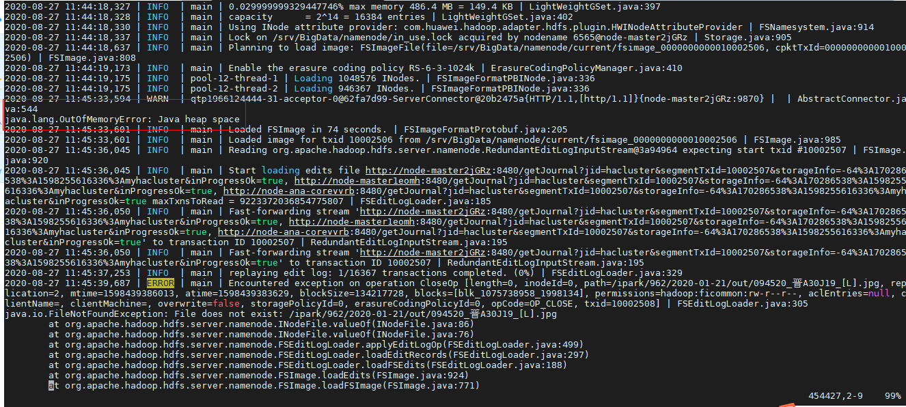

# 使用CDM迁移数据至HDFS

## 用户问题

使用CDM从旧的集群迁移数据至新集群的HDFS过程失败。

## 问题现象

使用CDM从源HDFS导入目的端HDFS，发现目的端MRS集群故障，NameNode无法启动。

查看日志发现在启动过程中存在Java heap space报错，需要修改NN的JVM参数。

**图 1**  故障日志  

## 原因分析

客户在使用CDM迁移数据的过程中，HDFS的数据量过大，导致在合并元数据时发生堆栈异常。

## 处理步骤

1.  进入HDFS服务配置页面：
    -   MRS 1.8.10之前版本，登录MRS Manager页面，具体请参见[访问MRS Manager](https://support.huaweicloud.com/usermanual-mrs/mrs_01_0102.html)，然后选择“服务管理 \> HDFS \> 服务配置”，单击“基础配置”下拉菜单，选择“全部配置”。
    -   MRS 1.8.10及之后版本，单击集群名称，登录集群详情页面，选择“组件管理 \> HDFS \> 服务配置”，单击“基础配置”下拉菜单，选择“全部配置”。

        > **说明：** 
        >若集群详情页面没有“组件管理”页签，请先完成IAM用户同步（在集群详情页的“概览”页签，单击“IAM用户同步“右侧的“同步”进行IAM用户同步）。

    -   MRS 3.x及后续版本，登录FusionInsight Manager，然后选择“集群 \>  _待操作的集群名_称 \> 服务 \> HDFS \> 配置 \> 全部配置”。

2.  搜索并修改“HDFS-\>NameNode” 中的“GC\_OPTS”参数，将其中的“-Xms512M -Xmx512M”两个参数的值根据实际情况调整为较大的值。
3.  保存配置并重启受影响的服务或实例。

