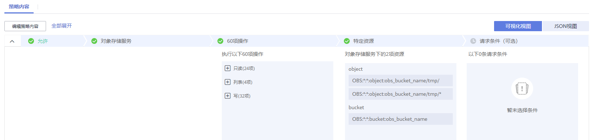

# 使用MRS多用户访问OBS功能时/tmp目录没有权限

## 用户问题

在使用MRS多用户访问OBS功能，执行spark、hive、presto等作业时，出现/tmp目录没有权限的报错。

## 问题现象

在使用MRS多用户访问OBS功能，执行spark、hive、presto等作业时，出现/tmp目录没有权限的报错。

## 原因分析

作业执行过程中有临时目录，提交作业的用户对临时目录没有权限。

## 处理步骤

1.  在集群“概览”页签中，查询并记录集群所绑定的委托名称。
2.  登录IAM服务控制台。
3.  选择“权限 \> 创建自定义策略”。

    -   策略名称：请输入策略名称。
    -   作用范围：请选择“全局级服务”。
    -   策略配置方式：请选择“可视化视图”。
    -   策略内容：
        1.  “允许”选择“允许”。
        2.  “云服务”选择“对象存储服务 \(OBS\)”。
        3.  “操作”勾选所有“写”、“列表”和“只读”权限。
        4.  “特定资源”选择：

            1.  “object”选择“通过资源路径指定”，并单击“添加资源路径”分别在“路径”中输入**_obs\_bucket\_name_/tmp/**和**_obs\_bucket\_name_/tmp/\***。此处以**/tmp**目录为例，如需其他目录权限请参考该步骤添加对应目录及该目录下所有对象的资源路径。
            2.  “bucket”选择“通过资源路径指定”，并单击“添加资源路径”在“路径”中输入**_obs\_bucket\_name_**。

            其中**obs\_bucket-name**请使用实际的OBS桶名替换。若桶类型为“并行文件系统”需要在添加**_obs\_bucket\_name_/tmp/**路径，桶类型为“对象存储”则不需要添加**_obs\_bucket\_name_/tmp/**路径。

        5.  （可选）请求条件，暂不添加。

    **图 1**  自定义策略  
    

4.  单击“确定”完成策略添加。
5.  选择“委托”，并在[1](#li0429141813311)中查询到的委托所在行的“操作”列单击“权限配置”。
6.  查询并勾选[3](#li18820555152219)中创建的策略。
7.  单击“确定”完成委托权限配置。

