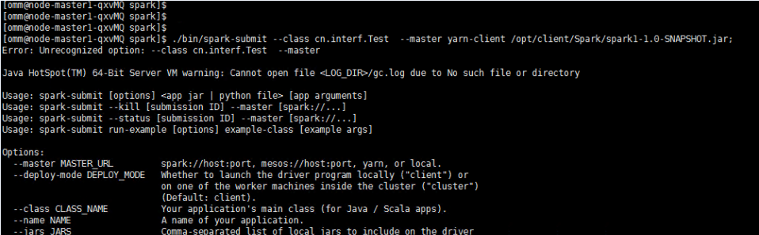

# 使用Spark时报错

## 用户问题

在使用spark时，集群运行失败。

## 问题现象

客户在使用spark组件时，集群运行失败。

## 原因分析

-   执行命令时，引入非法字符
-   上传的jar包属主属组有问题

## 处理步骤

1.  检查用户命令**./bin/spark-submit  --class cn.interf.Test  --master yarn-client  /opt/client/Spark/spark1-1.0-SNAPSHOT.jar;**，排查是否引入非法字符。
2.  如果是，修改非法字符，重新执行命令。
3.  重新执行命令后，发生其他错误，查看该jar包的属主属组，发现全为root。
4.  修改jar包的属主属组为 omm:wheel，重新执行成功。

