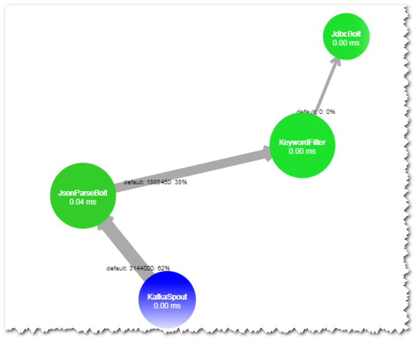
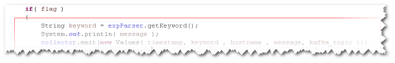

# 使用Storm-JDBC插件开发Oracle写入Bolt，发现数据无法写入

## 现象描述

使用Storm-JDBC插件开发Oracle写入Bolt，发现能连上Oracle数据库，但是无法向Oracle数据库里面写数据。

## 可能原因

-   拓扑定义异常。
-   数据库表结果定义异常。

## 原因分析

1.  通过Storm WebUI 查看拓扑DAG图，发现DAG图与拓扑定义一致。

    

1.  查看KeyWordFilter Bolt输出流字段定义和发送消息字段发现一致。

    

    

2.  查看Oracle数据库中表定义，发现字段名为大写，与流定义字段名称不一致。

    

3.  单独调试execute方法，发现抛出字段不存在。

    

## 处理步骤

修改流定义字段名称为大写，与数据库表定义字段一致。

