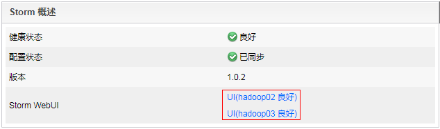
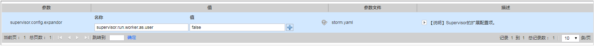
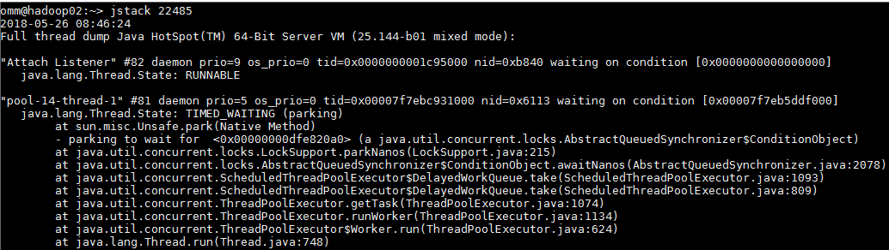

# 使用jstack命令查看进程堆栈提示well-known file is not secure

## 问题背景与现象

使用jstack命令查看进程堆栈信息报：well-known file is not secure。

## 原因分析

1.  由于执行命令的用户与当前查看pid信息的进程提交用户不一致导致。
2.  Storm引入区分用户执行任务特性，在启动worker进程时将给进程的的uid和gid改为提交用户和ficommon，目的是为了logviewer可以访问到worker进程的日志同时日志文件只开放权限到640。这样会导致切换到提交用户后对Worker进程执行jstack和jmap等命令执行失败，原因是提交用户的默认gid并不是ficommon，需要通过ldap命令修改提交用户的gid为9998（ficommon）才可执行。

## 解决办法

共有两种方式解决该问题。

方式一：通过storm原生页面查看进程堆栈

1.  通过storm原生页面查看：MRS Manager \> 服务管理

    

2.  选择要查看的拓扑。

    

3.  选择要查看的spout或者bolt。

    

4.  选择要查看的节点日志文件，再选择JStack或者Heap按钮，其中JStack对应的是堆栈信息，Heap对应的是堆信息：

    

方式二：通过修改自定义参数查看进程堆栈

1.  登录MRD Manager页面，选择“服务管理 \> Storm \> 服务配置”，“参数类别“选择“全部配置“。
2.  在左侧导航栏选择“supervisor \> 自定义”，添加一个变量supervisor.run.worker.as.user=false。

    

3.  单击“保存配置”，勾选“重新启动受影响的服务或实例。”并单击“确定”重启服务。
4.  重新提交拓扑。
5.  后台节点切为omm用户执行jps命令即可查看worker的pid。

    

6.  执行jstack pid，即可查看jstack信息。

    

