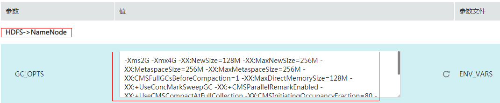

# 内存不足导致HDFS启动失败<a name="mrs_03_0075"></a>

## 问题背景与现象<a name="zh-cn_topic_0167275870_s6b990ebc666c4ba08e6bc5b71c23a056"></a>

重启HDFS后，HDFS的状态是Bad，且NameNode实例状态常常异常，并且花很久没有退出安全模式。

## 原因分析<a name="zh-cn_topic_0167275870_s44cfc435afe549c9a194adf24752a69c"></a>

1.  在NameNode运行日志（/var/log/Bigdata/hdfs/nn/hadoop-omm-namendoe-XXX.log）中搜索“WARN”，可以看到有大量时间在垃圾回收，如下例中耗时较长63s。

    ```
    2017-01-22 14:52:32,641 | WARN  | org.apache.hadoop.util.JvmPauseMonitor$Monitor@1b39fd82 | Detected pause in JVM or host machine (eg GC): pause of approximately 63750ms
    GC pool 'ParNew' had collection(s): count=1 time=0ms
    GC pool 'ConcurrentMarkSweep' had collection(s): count=1 time=63924ms | JvmPauseMonitor.java:189
    ```

2.  分析NameNode日志“/var/log/Bigdata/hdfs/nn/hadoop-omm-namendoe-XXX.log“，可以看到NameNode在等待块上报，且总的Block个数过多，如下例中是3629万。

    ```
    2017-01-22 14:52:32,641 | INFO  | IPC Server handler 8 on 25000 | STATE* Safe mode ON. 
    The reported blocks 29715437 needs additional 6542184 blocks to reach the threshold 0.9990 of total blocks 36293915.
    ```

3.  打开Manager页面，查看NameNode的GC\_OPTS参数配置如下：

    **图 1**  查看NameNode的GC\_OPTS参数配置<a name="zh-cn_topic_0167275870_fig128017425374"></a>  
    

4.  NameNode内存配置和数据量对应关系参考[表1](#zh-cn_topic_0167275870_table6905268173524)。

    **表 1**  NameNode内存配置和数据量对应关系

    <a name="zh-cn_topic_0167275870_table6905268173524"></a>
    <table><thead align="left"><tr id="zh-cn_topic_0167275870_row62851894173524"><th class="cellrowborder" valign="top" width="23%" id="mcps1.2.3.1.1"><p id="zh-cn_topic_0167275870_p57838652173524"><a name="zh-cn_topic_0167275870_p57838652173524"></a><a name="zh-cn_topic_0167275870_p57838652173524"></a><strong id="zh-cn_topic_0167275870_b50785821173524"><a name="zh-cn_topic_0167275870_b50785821173524"></a><a name="zh-cn_topic_0167275870_b50785821173524"></a>文件对象数量</strong></p>
    </th>
    <th class="cellrowborder" valign="top" width="77%" id="mcps1.2.3.1.2"><p id="zh-cn_topic_0167275870_p20010808173524"><a name="zh-cn_topic_0167275870_p20010808173524"></a><a name="zh-cn_topic_0167275870_p20010808173524"></a><strong id="zh-cn_topic_0167275870_b45879548173524"><a name="zh-cn_topic_0167275870_b45879548173524"></a><a name="zh-cn_topic_0167275870_b45879548173524"></a>参考值</strong></p>
    </th>
    </tr>
    </thead>
    <tbody><tr id="zh-cn_topic_0167275870_row25255944173524"><td class="cellrowborder" valign="top" width="23%" headers="mcps1.2.3.1.1 "><p id="zh-cn_topic_0167275870_p32465551173524"><a name="zh-cn_topic_0167275870_p32465551173524"></a><a name="zh-cn_topic_0167275870_p32465551173524"></a>10,000,000</p>
    </td>
    <td class="cellrowborder" valign="top" width="77%" headers="mcps1.2.3.1.2 "><p id="zh-cn_topic_0167275870_p12463995173524"><a name="zh-cn_topic_0167275870_p12463995173524"></a><a name="zh-cn_topic_0167275870_p12463995173524"></a>“-Xms6G -Xmx6G -XX:NewSize=512M -XX:MaxNewSize=512M”</p>
    </td>
    </tr>
    <tr id="zh-cn_topic_0167275870_row45067099173524"><td class="cellrowborder" valign="top" width="23%" headers="mcps1.2.3.1.1 "><p id="zh-cn_topic_0167275870_p26556377173524"><a name="zh-cn_topic_0167275870_p26556377173524"></a><a name="zh-cn_topic_0167275870_p26556377173524"></a>20,000,000</p>
    </td>
    <td class="cellrowborder" valign="top" width="77%" headers="mcps1.2.3.1.2 "><p id="zh-cn_topic_0167275870_p3582895173524"><a name="zh-cn_topic_0167275870_p3582895173524"></a><a name="zh-cn_topic_0167275870_p3582895173524"></a>“-Xms12G -Xmx12G -XX:NewSize=1G -XX:MaxNewSize=1G”</p>
    </td>
    </tr>
    <tr id="zh-cn_topic_0167275870_row32246059173524"><td class="cellrowborder" valign="top" width="23%" headers="mcps1.2.3.1.1 "><p id="zh-cn_topic_0167275870_p61793977173524"><a name="zh-cn_topic_0167275870_p61793977173524"></a><a name="zh-cn_topic_0167275870_p61793977173524"></a>50,000,000</p>
    </td>
    <td class="cellrowborder" valign="top" width="77%" headers="mcps1.2.3.1.2 "><p id="zh-cn_topic_0167275870_p39256244173524"><a name="zh-cn_topic_0167275870_p39256244173524"></a><a name="zh-cn_topic_0167275870_p39256244173524"></a>“-Xms32G -Xmx32G -XX:NewSize=2G -XX:MaxNewSize=3G”</p>
    </td>
    </tr>
    <tr id="zh-cn_topic_0167275870_row17761877173524"><td class="cellrowborder" valign="top" width="23%" headers="mcps1.2.3.1.1 "><p id="zh-cn_topic_0167275870_p29425950173524"><a name="zh-cn_topic_0167275870_p29425950173524"></a><a name="zh-cn_topic_0167275870_p29425950173524"></a>100,000,000</p>
    </td>
    <td class="cellrowborder" valign="top" width="77%" headers="mcps1.2.3.1.2 "><p id="zh-cn_topic_0167275870_p34691719173524"><a name="zh-cn_topic_0167275870_p34691719173524"></a><a name="zh-cn_topic_0167275870_p34691719173524"></a>“-Xms64G -Xmx64G -XX:NewSize=4G -XX:MaxNewSize=6G”</p>
    </td>
    </tr>
    <tr id="zh-cn_topic_0167275870_row43790015173524"><td class="cellrowborder" valign="top" width="23%" headers="mcps1.2.3.1.1 "><p id="zh-cn_topic_0167275870_p57330299173524"><a name="zh-cn_topic_0167275870_p57330299173524"></a><a name="zh-cn_topic_0167275870_p57330299173524"></a>200,000,000</p>
    </td>
    <td class="cellrowborder" valign="top" width="77%" headers="mcps1.2.3.1.2 "><p id="zh-cn_topic_0167275870_p13242668173524"><a name="zh-cn_topic_0167275870_p13242668173524"></a><a name="zh-cn_topic_0167275870_p13242668173524"></a>“-Xms96G -Xmx96G -XX:NewSize=8G -XX:MaxNewSize=9G”</p>
    </td>
    </tr>
    <tr id="zh-cn_topic_0167275870_row52075156173524"><td class="cellrowborder" valign="top" width="23%" headers="mcps1.2.3.1.1 "><p id="zh-cn_topic_0167275870_p57338127173524"><a name="zh-cn_topic_0167275870_p57338127173524"></a><a name="zh-cn_topic_0167275870_p57338127173524"></a>300,000,000</p>
    </td>
    <td class="cellrowborder" valign="top" width="77%" headers="mcps1.2.3.1.2 "><p id="zh-cn_topic_0167275870_p13876723173524"><a name="zh-cn_topic_0167275870_p13876723173524"></a><a name="zh-cn_topic_0167275870_p13876723173524"></a>“-Xms164G -Xmx164G -XX:NewSize=12G -XX:MaxNewSize=12G”</p>
    </td>
    </tr>
    </tbody>
    </table>


## 解决办法<a name="zh-cn_topic_0167275870_sc1a5740d60ce4c9dbc915284b1c9838a"></a>

1.  按照规格修改NameNode的内存参数，如这里3600万block，将内存参数调整为“-Xms32G -Xmx32G -XX:NewSize=2G -XX:MaxNewSize=3G”。
2.  重启一个NameNode，确认该NameNode可以正常启动。
3.  重启另一个NameNode，确认页面状态恢复。

