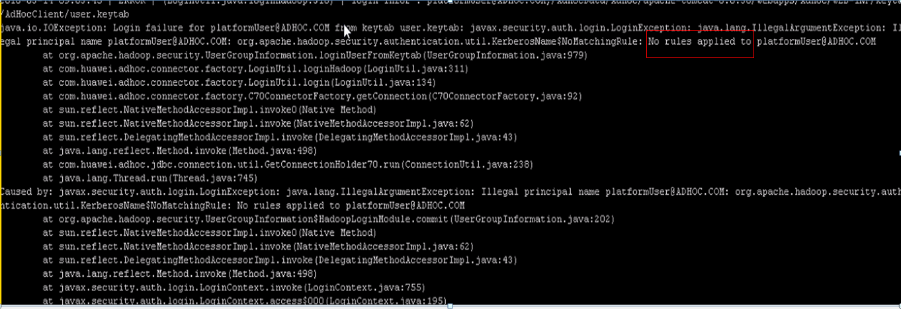

# 切域后Hive二次开发样例代码报错

## 问题背景与现象

hive的二次开发代码样例运行报No rules applied to \*\*\*\*的错误：

## 原因分析

1.  hive的二次开发样例代码会加载core-site.xml，此文件默认是通过classload加载，所以使用的时候要把此配置文件放到启动程序的classpath路径下面。
2.  如果修改了集群的域名，那么core-site.xml将发生变化，需要下载最新的core-site.xml并放入到打包hive二次开发样例代码进程的classpath路径下面。

## 解决办法

1.  下载集群Hive最新的客户端，获取最新的core-site.xml。
2.  将core-site.xml放入到打包hive二次开发样例代码进程的classpath路径下面。

