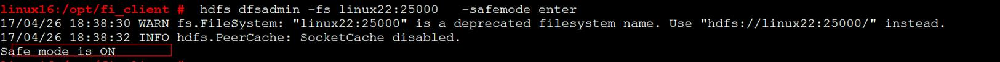
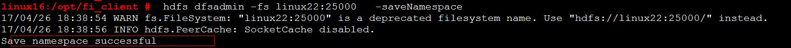
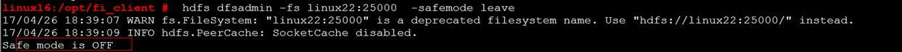
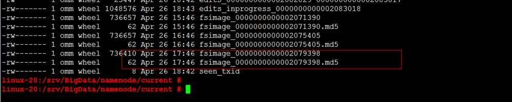

# 单NameNode长期故障，如何使用客户端手动checkpoint

## 问题背景与现象

在备NameNode长期异常的情况下，会积攒大量的editlog，此时如果重启HDFS或者主NameNode，主NameNode会读取大量的未合并的editlog，导致耗时启动较长，甚至启动失败。

## 原因分析

备NameNode会周期性做合并editlog，生成fsimage文件的过程叫做checkpoint。备NameNode在新生成fsimage后，会将fsimage传递到主NameNode。

> **说明：** 
>由于“备NameNode会周期性做合并editlog”，因此当备NameNode异常时，无法合并editlog，因此主NameNode在下次启动的时候，需要加载较多editlog，需要大量内存，并且耗时较长。

合并元数据的周期由以下参数确定，即如果NameNode运行30分钟或者HDFS操作100万次，均会执行checkpoint。

-   dfs.namenode.checkpoint.period：checkpoint周期，默认1800s。
-   dfs.namenode.checkpoint.txns：执行指定操作次数后执行checkpoint，默认1000000。

## 解决办法

在重启前，主动执行异常checkpoint合并主NameNode的元数据。

1.  停止业务。
2.  获取主NameNode的主机名。
3.  在客户端执行如下命令：

    **source /opt/client/bigdata\_env**

    **kinit  _组件用户_**

    说明：/opt/client 需要换为实际客户端的安装路径。

4.  执行如下命令，让主NameNode进入安全模式，其中linux22换为主NameNode的主机名。

    **hdfs dfsadmin -fs linux22:25000 -safemode enter**

    

5.  执行如下命令，在主NameNode，合并editlog。

    **hdfs dfsadmin -fs linux22:25000 -saveNamespace**

    

6.  执行如下命令，让主NameNode离开安全模式。

    **hdfs dfsadmin -fs linux22:25000 -safemode leave**

    

7.  检查是否真的合并完成。

    **cd /srv/BigData/namenode/current**

    检查先产生的fsimage是否是当前时间的，若是则表示已经合并完成

    

