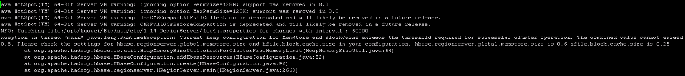

# 参数不合理导致HBase启动失败<a name="mrs_03_0069"></a>

## 问题现象<a name="zh-cn_topic_0167276537_s08db4020975e4c7fa72767e29ba33c59"></a>

修改部分参数后，无法正常启动HBase。

## 原因分析<a name="zh-cn_topic_0167276537_sa7a8ff8be9e3457c8983fd9a4827a8f9"></a>

1.  查看HMaster日志（/var/log/Bigdata/hbase/hm/hbase-omm-xxx.log）显示，hbase.regionserver.global.memstore.size + hfile.block.cache.size总和大于0.8导致启动不成功，因此需要调整参数配置值总和低于0.8。

    

2.  查看HMaster和RegionServer的out日志（/var/log/Bigdata/hbase/hm/hbase-omm-xxx.out/var/log/Bigdata/hbase/rs/hbase-omm-xxx.out），提示Unrecognized VM option。

    ```
    Unrecognized VM option 
    Error: Could not create the Java Virtual Machine.
    Error: A fatal exception has occurred. Program will exit.
    ```

    检查GC\_OPTS相关参数存在多余空格，如-D sun.rmi.dgc.server.gcInterval=0x7FFFFFFFFFFFFFE。


## 解决办法<a name="zh-cn_topic_0167276537_s091164cf2f8c4f5d81234e9d7a43173f"></a>

1.  针对memstore、cache修改配置参数后，重启HBase服务成功。
2.  针对GC\_OPTS配置错误，修改参数后重启HBase服务成功。

