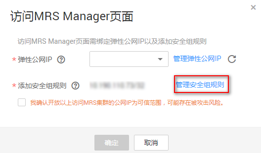

# 启动Yarn后发现一堆job

## 用户问题

客户构建MRS集群启动Yarn后，发现一堆job占用资源。

## 问题现象

客户使用MapReduce服务构建集群启动Yarn后 生成一堆job占用资源。

## 原因分析

-   疑似黑客攻击。
-   安全组入口方向的Any协议源地址配置为0.0.0.0/0。

## 处理步骤

1.  登录MRS集群页面，在“现有集群“中，单击对应的集群名称，进入集群详情页面。
2.  单击“集群管理页面“后面的“点击查看“，弹出“访问MRS Manager页面“。
3.  单击“管理安全组规则“，检查安全组规则配置。

    

4.  检查入口方向Any协议的源地址是否为0.0.0.0/0。
5.  如果是，修改入口方向Any协议的远端为指定IP地址。如果不是，则无需修改。
6.  修改成功后，重启集群虚机。

## 建议与总结

关闭入口方向的Any协议，或者指定入口方向的Any协议远端为指定IP。

## 参考信息

请参考[集群（未启用Kerberos认证）安全配置建议](https://support.huaweicloud.com/usermanual-mrs/mrs_01_0419.html)。

