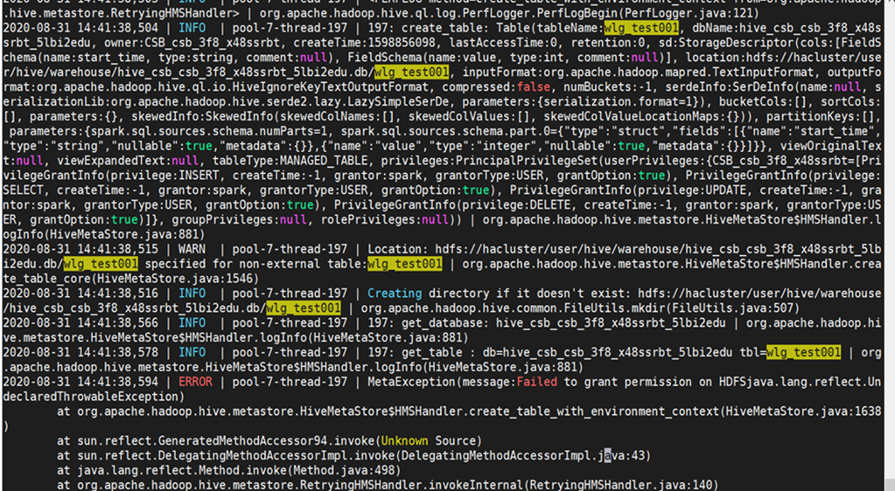
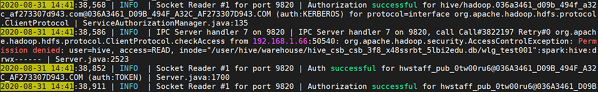
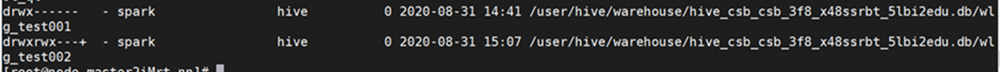
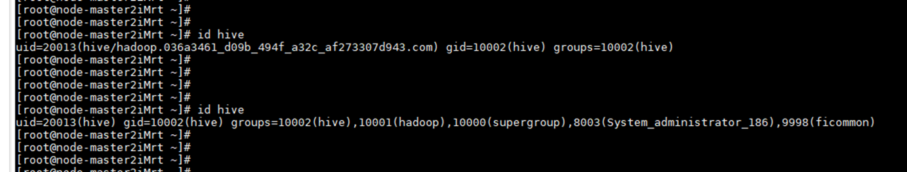

# 在spark-beeline中创建/删除表失败<a name="mrs_03_0270"></a>

## 用户问题<a name="section18305143583116"></a>

客户在spark-beeline频繁创建和删除大量用户的场景下，个别用户偶现创建/删除表失败。

## 问题现象<a name="section117424454313"></a>

创建表过程：

```
CREATE TABLE wlg_test001 (start_time STRING,value INT);
```

报错:

```
Error: org.apache.spark.sql.AnalysisException: 
org.apache.hadoop.hive.ql.metadata.HiveException: MetaException(message:Failed to grant permission on HDFSjava.lang.reflect.UndeclaredThrowableException); (state=,code=0)
```

## 原因分析<a name="section1237061220324"></a>

1.  查看metastore日志

    

2.  查看hdfs日志

    

3.  权限对比（test001为异常用户创建表，test002为正常用户创建表）

    

4.  drop表时报类似下面的错

    ```
    0: jdbc:hive2://192.168.1.42:10000/> drop table
    dataplan_modela_csbch2;
    Error: Error while compiling statement: FAILED:
    SemanticException Unable to fetch table dataplan_modela_csbch2.
    java.security.AccessControlException: Permission denied: user=CSB_csb_3f8_x48ssrbt,
    access=READ,
    inode="/user/hive/warehouse/hive_csb_csb_3f8_x48ssrbt_5lbi2edu.db/dataplan_modela_csbch2":spark:hive:drwx------
    ```

5.  根因分析。

    创建集群时创建的默认用户使用了相同的uid，造成用户错乱。在大量创建用户的场景下，触发了该问题，导致在创建表时偶现hive用户没有权限。

    

    .png)


## 处理步骤<a name="section10504161711314"></a>

重启集群sssd进程。

以root用户执行**service sssd restart**命令重启sssd服务，执行**ps -ef | grep sssd**命令，查看sssd进程是否正常。

正常状态为：存在/usr/sbin/sssd进程和三个子进程/usr/libexec/sssd/sssd\_be、/usr/libexec/sssd/sssd\_nss、/usr/libexec/sssd/sssd\_pam。

