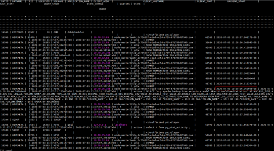
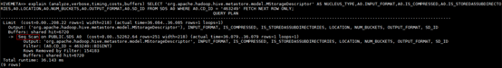
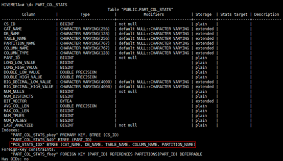
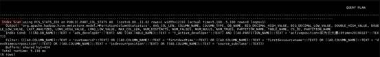

# 增加Hive表字段超时<a name="mrs_03_0236"></a>

## 用户问题<a name="section13187114414467"></a>

增加Hive表字段报错。

## 问题现象<a name="section97011249184619"></a>

Hive对包含10000+分区的表执行**ALTER TABLE table\_name ADD COLUMNS\(column\_name string\) CASCADE;**，报错如下：

```
Timeout when executing method: alter_table_with_environment_context; 600525ms exceeds 600000ms
```

## 原因分析<a name="section029110184720"></a>

1.  MetaStore客户端连接超时，MRS默认MetaStore客户端和服务端连接的超时时间是600s，在Manager页面调大hive.metastore.client.socket.timeout为3600s。
2.  出现另一个报错：

    ```
    Error: org.apache.hive.service.cli.HiveSQLException: Error while processing statement: FAILED: Execution Error, return code 1 from org.apache.hadoop.hive.ql.exec.DDLTask. Unable to alter table. java.net.SocketTimeoutException: Read timed out
    ```

    Metastore元数据JDBC连接超时，默认60ms。

3.  调大javax.jdo.option.ConnectionURL中socketTimeout=60000，仍然产生最初的报错：

    ```
    Timeout when executing method: alter_table_with_environment_context;3600556ms exceeds 3600000ms
    ```

4.  尝试调大hive.metastore.batch.retrieve.max、hive.metastore.batch.retrieve.table.partition.max、dbservice.database.max.connections等参数均未能解决。
5.  怀疑是GaussDB的问题，因为增加字段会遍历每个分区执行getPartitionColumnStatistics和alterPartition。
6.  使用omm用户执行**gsql -p 20051 -U omm -W dbserverAdmin@123 -d hivemeta**登录hive元数据库。
7.  执行**select \* from pg\_locks;**没有发现锁等待。
8.  <a name="li22076248359"></a>执行**select \* from pg\_stat\_activity;**发现进程执行时间较长。

    ```
    SELECT 'org.apache.hadoop.hive.metastore.model.MPartitionColumnStatistics'AS NUCLEUS_TYPE,A0.AVG_COL_LEN,A0."COLUMN_NAME",A0.COLUMN_TYPE,A0.DB_NAME,A0.BIG_DECIMAL_HIGH_VALUE,A0.BIG_DECIMAL_LOW_VALUE,A0.DOUBLE_HIGH_VALUE,A0.DOUBLE_LOW_VALUE,A0.LAST_ANALYZED,A0.LONG_HIGH_VALUE,A0.LONG_LOW_VALUE,A0.MAX_COL_LEN,A0.NUM_DISTINCTS,A0.NUM_FALSES,A0.NUM_NULLS,A0.NUM_TRUES,A0.PARTITION_NAME,A0."TABLE_NAME",A0.CS_ID,A0.PARTITION_NAMEAS NUCORDER0 FROM PART_COL_STATS A0 WHERE A0."TABLE_NAME" = '$1' ANDA0.DB_NAME = '$2' AND A0.PARTITION_NAME = '$3' AND((((((A0."COLUMN_NAME" = '$4') OR (A0."COLUMN_NAME" ='$5')) OR (A0."COLUMN_NAME" = '$6')) OR (A0."COLUMN_NAME" ='$7')) OR (A0."COLUMN_NAME" = '$8')) OR (A0."COLUMN_NAME" ='$9')) ORDER BY NUCORDER0;
    ```

    

9.  执行**gs\_guc reload -c log\_min\_duration\_statement=100 -D /srv/BigData/dbdata\_service/data/**开启sql录制，发现[8.执行select \* from pg\_sta...](#li22076248359)中语句执行时长700ms，而且因为有10000+分区，会触发执行10000+次命令。
10. 在sql前加explain \(analyze,verbose,timing,costs,buffers\)分析执行计划，发现执行时需要全表扫描。

    

11. 查看索引，发现不满足最左匹配原则。

    


## 处理步骤<a name="section123801581473"></a>

1.  重建索引。

    ```
    su – omm
    gsql -p 20051 -U omm -W dbserverAdmin@123 -d hivemeta
    DROP INDEX PCS_STATS_IDX;
    CREATE INDEX PCS_STATS_IDX ON PART_COL_STATS(DB_NAME, TABLE_NAME, COLUMN_NAME, PARTITION_NAME);
    CREATE INDEX SDS_N50 ON SDS(CD_ID);
    ```

2.  重新查看执行计划，发现语句已经可以索引查询，且5ms执行完成（原来是700ms）。重新执行hive表字段增加，已经可以添加成功。

    


