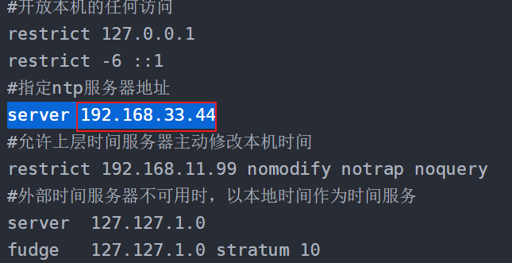

# 如何修改集群节点的NTP服务器地址？<a name="mrs_03_0256"></a>

## 用户问题<a name="section18305143583116"></a>

如何修改集群节点的NTP服务器地址？

## 问题现象<a name="section117424454313"></a>

集群访问OBS上报403异常。

## 原因分析<a name="section1237061220324"></a>

集群Master节点NTP时间与集群外节点的NTP服务器时间不同步，时间相差超过15min，导致集群访问OBS时鉴权失败，上报403异常。

## 处理步骤<a name="section11434536111214"></a>

1.  以**root**用户登录集群主Master节点。
2.  查看当前节点的NTP配置。

    **cat /etc/ntp.conf**

3.  修改NTP服务器地址为**ntp.myhuaweicloud.com。**

    

4.  在集群所有节点中执行如下命令强制同步主机与NTP服务器的时间。

    ```
    service ntpd stop
    ntpdate ntp.myhuaweicloud.com
    service ntpd start
    service ntpd status
    ```

5.  在主Master节点的以下文件修改NTP服务器地址为**ntp.myhuaweicloud.com**。

    /opt/Bigdata/nodeagent/ntp.conf.agent

    /opt/Bigdata/**OMSV100R001C00x8664**/workspace0/conf/ntp.conf.active

    /opt/Bigdata/**OMSV100R001C00x8664**/workspace0/conf/ntp.conf.standby

    /etc/ntp.conf

    > **说明：** 
    >OMSV100R001C00x8664为OMS版本号，请以实际环境为准。

6.  重启NTP服务。

    **service ntpd restart**


