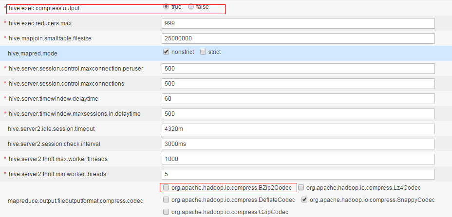

# 如何在导入表时指定输出的文件压缩格式<a name="ZH-CN_TOPIC_0205107312"></a>

## 问题现象<a name="zh-cn_topic_0167274995_section1861111131114"></a>

如何在导入表时指定输出的文件压缩格式？

## 处理步骤<a name="zh-cn_topic_0167274995_s2b7f9c0f6ad247c2a6cd286ddb33568a"></a>

当前Hive支持以下几种压缩格式：

```
org.apache.hadoop.io.compress.BZip2Codec
org.apache.hadoop.io.compress.Lz4Codec
org.apache.hadoop.io.compress.DeflateCodec
org.apache.hadoop.io.compress.SnappyCodec
org.apache.hadoop.io.compress.GzipCodec
```

-   如需要全局设置，即对所有表都进行压缩，可以在MRS Manager页面的“服务管理 \> Hive \> 服务配置”中对Hive的服务配置参数进行如下全局配置：

    

    > **说明：**   
    >hive.exec.compress.output参数必须设置为true，才能使下边的参数选项生效。  

-   如需在session级设置，只需要在执行命令前增加如下设置即可：

    ```
    set hive.exec.compress.output=true; 
    set mapreduce.output.fileoutputformat.compress.codec=org.apache.hadoop.io.compress.SnappyCodec;
    ```


