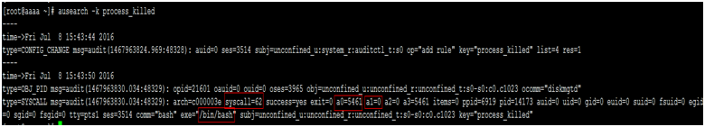
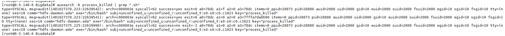

# 如何定位进程被kill<a name="mrs_03_0137"></a>

## 问题背景与现象<a name="zh-cn_topic_0167275628_section5966838993845"></a>

在某环境出现DataNode异常重启，且确认此时未从页面做重启DataNode的操作，需要定位是什么进程kill DataNode服务端进程。

## 原因分析<a name="zh-cn_topic_0167275628_section231689269397"></a>

常见的进程被异常终止有2种原因：

-   **Java进程OOM被Kill**

    一般Jave进程都会配置OOM Killer，当检测到OOM会自动Kill，OOM日志通常被打印到out日志中，此时可以看运行日志（如DataNode的日志路径为 /var/log/Bigdata/hdfs/dn/hadoop-omm-datanode-主机名.log），看是否有OutOfMemory 内存溢出的打印。


-   **被其他进程kill，或者人为kill。**

    排查DataNode运行日志（/var/log/Bigdata/hdfs/dn/hadoop-omm-datanode-主机名.log），是先收到“RECEIVED SIGNAL 15”再健康检查失败。即如下示例中DataNode先于 11:04:48被kill，然后过2分钟，于 11:06:52启动。

    ```
    2018-12-06 11:04：48,433 | ERROR | SIGTERM handler | RECEIVED SIGNAL 15: SIGTERM | LogAdapter.java:69
    2018-12-06 11:04:48,436 | INFO  | Thread-1 | SHUTDOWN_MSG:
    /************************************************************
    SHUTDOWN_MSG: Shutting down DataNode at 192-168-235-85/192.168.235.85
    ************************************************************/ | LogAdapter.java:45
    2018-12-06 11:06:52,744 | INFO  | main | STARTUP_MSG:
    ```

    以上日志说明，DataNode先被其他进程关闭，然后健康检查失败，2分钟后，被NodeAgent启动DataNode进程。


## 处理步骤<a name="zh-cn_topic_0167275628_section4029653894947"></a>

打开操作系统审计日志，给审计日志增加记录kill命令的规则，即可定位是何进程发送的kill命令。

**操作影响**

-   打印审计日志，会消耗一定操作系统性能，经过分析仅影响不到1%。
-   打印审计日志，会占用一定磁盘空间。该日志打印量不大，MB级别，且默认配置有老化机制和检测磁盘剩余空间机制，不会占满磁盘。

**定位方法**

在DataNode进程可能发生重启的所有节点，分别执行以下操作。

1.  以**root**用户登录节点，执行**service auditd status**命令，确认该服务状态。

    ```
    Checking for service auditd  running
    ```

    如果该服务未启动，执行**service auditd restart**命令重启该服务（无影响，耗时不到1秒）

    ```
    Shutting down auditd done
    Starting auditd done
    ```

2.  审计日志临时增加kill命令审计规则。

    增加规则：

    **auditctl -a exit,always -F arch=b64 -S kill -S tkill -S tgkill -F a1!=0 -k process\_killed**

    查看规则：

    **auditctl -l**

3.  当进程有异常被kill后，使用**ausearch -k process\_killed**命令，可以查询kill历史。

    

    > **说明：** 
    >a0是被kill进程的pid（16进制），a1是kill命令的信号量。


**验证方法**

1.  从MRS页面重启该节点一个实例，如DataNode。
2.  执行**ausearch -k process\_killed**命令，确认是否有日志打印。

    例如以下命令ausearch -k process\_killed |grep “.sh” ，可以看到是hdfs-daemon-ada\* 脚本，关闭的DataNode进程。

    


**停止审计kill命令方法**

1.  执行**service auditd restart**命令，即会清理临时增加的kill审计日志。
2.  执行**auditctl -l**命令，如果没有kill相关信息，即说明已清理该规则。

