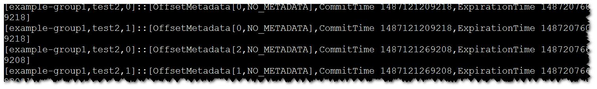

# 如何读取“\_\_consumer\_offsets”内部topic的内容<a name="ZH-CN_TOPIC_0226521597"></a>

## 用户问题<a name="zh-cn_topic_0167275877_section4387018310447"></a>

kafka如何将consumer 消费的offset保存在内部topic“ \_\_consumer\_offsets”中？

## 处理步骤<a name="zh-cn_topic_0167275877_section25565032202013"></a>

1.  使用PuTTY工具，以客户端安装用户，登录安装Kafka客户端的节点。
2.  切换到Kafka客户端安装目录，例如“/opt/client”。

    **cd /opt/client**

3.  执行以下命令，配置环境变量。

    **source bigdata\_env**

4.  执行以下命令，进行用户认证。（普通集群跳过此步骤）

    **kinit** _组件业务用户_

5.  执行以下命令，切换到Kafka客户端安装目录。

    **cd Kafka/kafka/bin**

6.  执行以下命令，获取consumer offset metric信息。

    **kafka-console-consumer.sh --topic \_\_consumer\_offsets --zookeeper <zk\_host:port\>/kafka --formatter "kafka.coordinator.group.GroupMetadataManager\\$OffsetsMessageFormatter" --consumer.config <property file\> --from-beginning**

    其中<property file\>配置文件中需要增加如下内容。

    ```
    exclude.internal.topics = false
    ```

    例如：

    **kafka-console-consumer.sh --topic \_\_consumer\_offsets --zookeeper 10.5.144.2:2181/kafka --formatter "kafka.coordinator.group.GroupMetadataManager\\$OffsetsMessageFormatter" --consumer.config ../config/consumer.properties --from-beginning**

    


