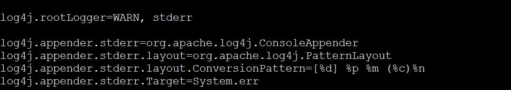
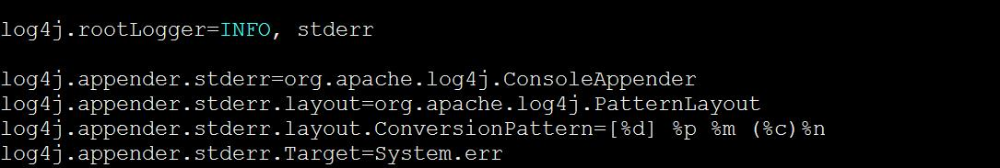

# 如何配置客户端shell命令的日志<a name="ZH-CN_TOPIC_0226521598"></a>

## 用户问题<a name="zh-cn_topic_0167276308_section4387018310447"></a>

如何设置客户端shell命令的日志输出级别？

## 处理步骤<a name="zh-cn_topic_0167276308_section16665572144748"></a>

1.  使用PuTTY工具，以客户端安装用户，登录安装Kafka客户端的节点。
2.  切换到Kafka客户端安装目录，例如“/opt/client”。

    **cd /opt/client**

3.  切换到Kafka客户端配置目录。

    **cd Kafka/kafka/config**

4.  编辑tools-log4j.properties文件，将WARN修改为INFO，并保存。

    

    

5.  切换到Kafka客户端安装目录，例如“/opt/client”。

    **cd /opt/client**

6.  执行以下命令，配置环境变量。

    **source bigdata\_env**

7.  执行以下命令，进行用户认证。（普通集群跳过此步骤）

    **kinit** _组件业务用户_

8.  执行以下命令，切换到Kafka客户端安装目录。

    **cd Kafka/kafka/bin**

9.  执行以下命令，获取topic信息，在控制台可见日志打印。

    ```
    kafka-topics.sh --list --zookeeper 10.5.144.2:2181/kafka
    ```

    ```
    [2017-02-17 14:34:27,005] INFO JAAS File name: /opt/client/Kafka/./kafka/config/jaas.conf (org.I0Itec.zkclient.ZkClient)
    [2017-02-17 14:34:27,007] INFO Starting ZkClient event thread. (org.I0Itec.zkclient.ZkEventThread)
    [2017-02-17 14:34:27,013] INFO Client environment:zookeeper.version=V100R002C10, built on 05/12/2016 08:56 GMT (org.apache.zookeeper.ZooKeeper)
    [2017-02-17 14:34:27,013] INFO Client environment:host.name=10-10-144-2 (org.apache.zookeeper.ZooKeeper)
    [2017-02-17 14:34:27,013] INFO Client environment:java.version=1.8.0_72 (org.apache.zookeeper.ZooKeeper)
    [2017-02-17 14:34:27,013] INFO Client environment:java.vendor=Oracle Corporation (org.apache.zookeeper.ZooKeeper)
    [2017-02-17 14:34:27,013] INFO Client environment:java.home=/opt/client/JDK/jdk/jre (org.apache.zookeeper.ZooKeeper)
    Test
    __consumer_offsets
    counter
    test
    test2
    test3
    test4
    
    ```


