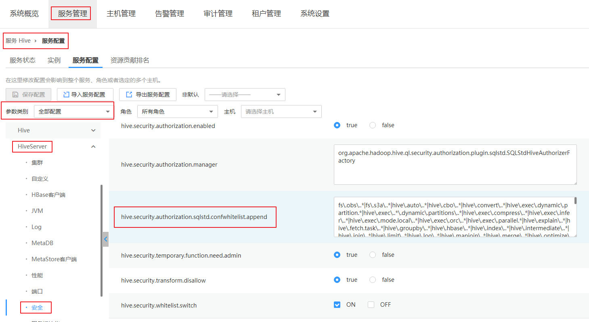

# 安全集群执行set命令的时候报Cannot modify xxx at runtime.<a name="mrs_03_0149"></a>

## 问题现象<a name="zh-cn_topic_0167276539_s39c985fc238f442f8e1c8acf7034746e"></a>

执行set命令时报以下错误：

```
0: jdbc:hive2://192.168.1.18:21066/> set mapred.job.queue.name=QueueA;
 Error: Error while processing statement: Cannot modify mapred.job.queue.name at list of params that are allowed to be modified at runtime (state=42000,code=1)
```

## 处理步骤<a name="zh-cn_topic_0167276539_s83a8a5828208497e9b7c7f427a94dbbe"></a>

**方案1：**

1.  登录Manager界面，修改Hive参数。
    -   MRS Manager界面操作：登录MRS Manager页面，选择“服务管理 \> Hive \> 服务配置 \> 全部配置 \> HiveServer \> 安全”。
    -   FusionInsight Manager界面操作：登录FusionInsight Manager页面，选择“集群 \>  _待操作集群的名称_  \> 服务 \> Hive \> 配置 \> 全部配置 \> HiveServer \> 安全”。

2.  将需要执行的命令参数添加到配置项hive.security.authorization.sqlstd.confwhitelist.append中。
3.  单击保存并重启HiveServer后即可。如下图所示：

    


**方案2：**

1.  登录Manager界面，修改Hive参数。
    -   MRS Manager界面操作：登录MRS Manager页面，选择“服务管理 \> Hive \> 服务配置 \> 全部配置 \> HiveServer \> 安全”。
    -   FusionInsight Manager界面操作：登录FusionInsight Manager页面，选择“集群 \>  _待操作集群的名称_  \> 服务 \> Hive \> 配置 \> 全部配置 \> HiveServer \> 安全”。

2.  找到选项hive.security.whitelist.switch，选择OFF，单击保存并重启HiveServer即可。

