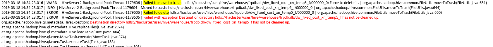

# 对同一张表或分区并发写数据导致任务失败

## 问题背景与现象

Hive执行插入语句时，报错HDFS上文件或目录已存在或被清除，具体报错如下：

## 原因分析

1.  根据HiveServer的审计日志，确认该任务的开始时间和结束时间。
2.  在上述时间区间内，查找是否有对同一张表或分区进行插入数据的操作。
3.  Hive不支持对同一张表或分区进行并发数据插入，这样会导致多个任务操作同一个数据临时目录，一个任务将另一个任务的数据移走，导致任务失败。

## 解决办法

修改业务逻辑，单线程插入数据到同一张表或分区。

