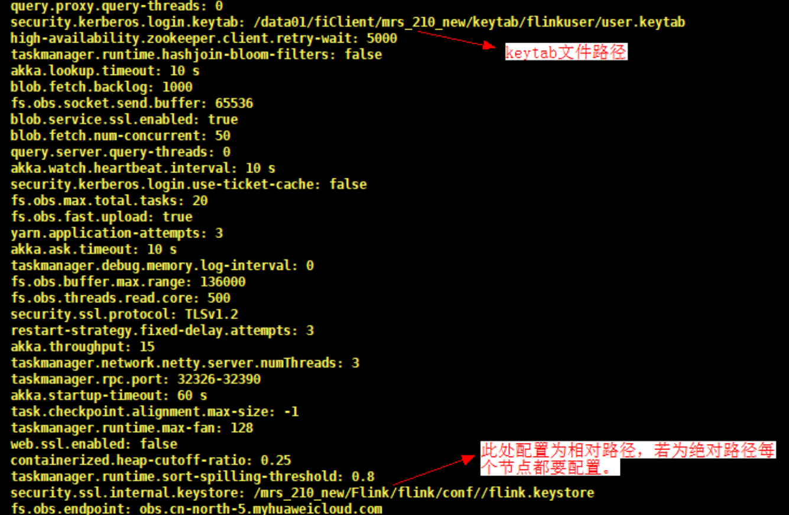
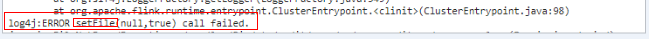
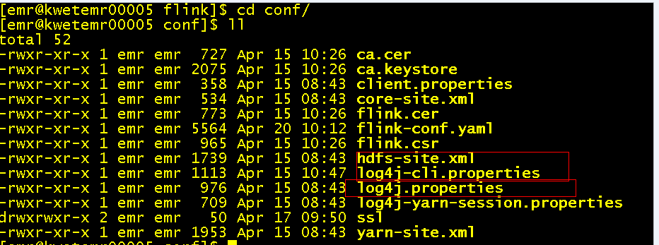
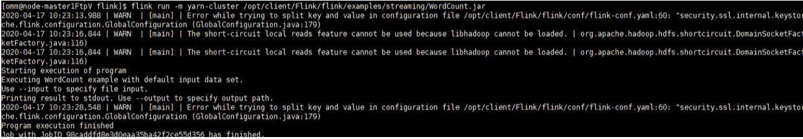

# 开启Kerberos认证集群提交Flink作业报错<a name="mrs_03_0233"></a>

## 用户问题<a name="section18305143583116"></a>

用户开启Kerberos认证提交flink作业报错。

## 问题现象<a name="section117424454313"></a>

客户提交flink官方案例./flink run /opt/client/Flink/flink/examples/streaming/WordCount.jar报错：unable to establish the security context。

## 原因分析<a name="section1237061220324"></a>

1.  客户开启了kerberos认证但是无法提交作业，所以首先检查权限配置问题，检查发现未正确配置/opt/client/Flink/flink/conf/flink-conf.yaml”中的参数。

    **图 1**  flink-conf.yaml配置<a name="fig53492389109"></a>  
    

    具体其他配置参见[配置管理Flink](https://support.huaweicloud.com/cmpntguide-mrs/mrs_01_1565.html)。

2.  修改并刷新配置后，重新提交作业出现作业可以提交但报log4j:ERROR setFile\(null,true\) call failed的错误。

    **图 2**  log4j报错<a name="fig0515315105"></a>  
    

3.  发现是log4j相关的报错，查看log4j发现客户将log4j.properties文件改成了log4g-cli.properties（log4j.properties的名字是固定的不可随意修改）于是报错。

    **图 3**  查看log4j<a name="fig623919461294"></a>  
    

4.  修改后可以正常提交作业。

    **图 4**  提交作业正常<a name="fig1851431816134"></a>  
    


## 处理步骤<a name="section06851293713"></a>

1.  判断用户是在集群外还是集群内使用客户端提交作业。
    1.  若在集群内使用客户端，切换到omm用户提交作业。
    2.  若在集群外使用客户端，则要使用root用户提交作业。

2.  检查flink-conf.yaml各参数是否配置正确，配置请参考[配置管理Flink](https://support.huaweicloud.com/cmpntguide-mrs/mrs_01_1565.html)。
3.  对于开启Kerberos认证的集群配置项包括Kerberos的keytab、principal等。
    -   从KDC服务器上下载用户keytab，并将keytab放到Flink客户端所在主机的某个文件夹下\(例如/home/flinkuser/keytab\)。
    -   在“$\{FLINK\_HOME\}/conf/flink-conf.yaml”上配置：
        1.  keytab路径（注意配置参数前面有空格）：

            ```
            security.kerberos.login.keytab:  /home/flinkuser/keytab/uer.keytab
            ```

        2.  principal名\(即开发用户名\)：

            ```
            security.kerberos.login.principal:flinkuser
            ```


4.  重新正确提交作业**./flink run /opt/client/Flink/flink/examples/streaming/WordCount.jar**，验证是否可以提交作业。
    -   若可以提交作业则说明权限认证没有问题，就可以去检查其他错误，本例中是修改了log4j.properties的名称，还原后可以正常提交作业。
    -   若提交作业失败，请提交工单进行处理。


## 参考信息<a name="section18208334123312"></a>

Flink使用请参考[从零开始使用Flink](https://support.huaweicloud.com/cmpntguide-mrs/mrs_01_0473.html)。

