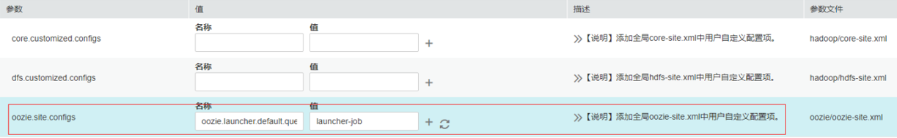

# 当并发提交大量oozie任务时，任务一直没有运行

## 用户问题

并发提交大量oozie任务的时候，任务一直没有运行。

## 问题现象

并发提交大量oozie任务的时候，任务一直没有运行。

## 原因分析

Oozie提交任务会先启动一个oozie-launcher，然后由oozie-launcher提交真正的作业运行。默认情况下launcher和真实作业会在同一个队列中。

当并发提交大量oozie任务的时候就有可能出现启动了一堆oozie-launcher，将队列的资源耗完，而没有更多资源启动真实作业，最终导致任务一直没有运行。

## 处理步骤

1.  参考“用户指南 \> 管理现有集群 \> 租户管理 \> 添加租户”章节新建一个队列给oozie使用，也可以直接使用创建MRS集群时生成的launcher-job队列。
2.  在Manager页面选择“集群  \> 服务 \> Oozie \> 配置”，搜索参数“oozie.site.configs”，在值列添加名称“oozie.launcher.default.queue”，值为“launcher-job”。

    

