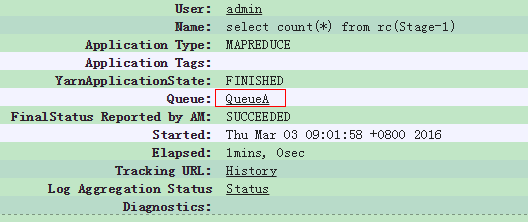

# 怎样在Hive提交任务的时候指定队列？<a name="mrs_03_0151"></a>

## 问题现象<a name="zh-cn_topic_0167275309_section1861111131114"></a>

怎样在Hive提交任务的时候指定队列？

## 处理步骤<a name="zh-cn_topic_0167275309_s7e783a52909443d3a165df5165f5cd46"></a>

1.  在执行语句前通过如下参数设置任务队列，例如，提交任务至队列QueueA。

    ```
    set mapred.job.queue.name=QueueA;
    select count(*) from rc;
    ```

2.  提交任务后，可在Yarn页面看到，如下任务已经提交到队列QueueA。

    

    > **说明：** 
    >队列的名称区分大小写，如写成queueA，Queuea均无效。


