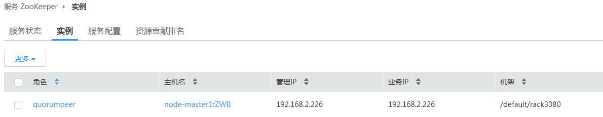

# 执行Kafka Topic删除操作，发现无法删除<a name="mrs_03_0108"></a>

## 问题背景与现象<a name="zh-cn_topic_0167276065_s5d135719deec4560b99adb07a0aa6416"></a>

在使用Kafka客户端命令删除Topic时，发现Topic无法被删除。

```
kafka-topics.sh --delete --topic test --zookeeper 192.168.234.231:2181/kafka
```

## 可能原因<a name="zh-cn_topic_0167276065_s8efdc02bbb1a42cba8fa3e43e2e68817"></a>

-   客户端命令连接ZooKeeper地址错误。
-   Kafka服务异常Kafka部分节点处于停止状态。
-   Kafka服务端配置禁止删除。
-   Kafka配置自动创建，且Producer未停止。

## 原因分析<a name="zh-cn_topic_0167276065_sbd00dc84aeac496f992e568196e9a879"></a>

1.  客户端命令，打印ZkTimeoutException异常。

    ```
    [2016-03-09 10:41:45,773] WARN Can not get the principle name from server 192.168.234.231 (org.apache.zookeeper.ClientCnxn)
    Exception in thread "main" org.I0Itec.zkclient.exception.ZkTimeoutException: Unable to connect to zookeeper server within timeout: 30000
    at org.I0Itec.zkclient.ZkClient.connect(ZkClient.java:880)
    at org.I0Itec.zkclient.ZkClient.<init>(ZkClient.java:98)
    at org.I0Itec.zkclient.ZkClient.<init>(ZkClient.java:84)
    at kafka.admin.TopicCommand$.main(TopicCommand.scala:51)
    at kafka.admin.TopicCommand.main(TopicCommand.scala)
    ```

    解决方法参考[1](#zh-cn_topic_0167276065_l65c91bf38d6d492a90463cbb43bacfcd)。

2.  客户端查询命令。

    **kafka-topics.sh --list --zookeeper 192.168.0.122:2181/kafka**

    ```
    test - marked for deletion
    ```

    通过Manager查看Kafka Broker实例的运行状态。

    通过**cd /var/log/Bigdata/kafka/broker**命令进入RunningAsController节点日志目录，在controller.log发现ineligible for deletion: test。

    ```
    2016-03-09 11:11:26,228 | INFO  | [main] | [Controller 1]: List of topics to be deleted:  | kafka.controller.KafkaController (Logging.scala:68)
    2016-03-09 11:11:26,229 | INFO  | [main] | [Controller 1]: List of topics ineligible for deletion: test | kafka.controller.KafkaController (Logging.scala:68)
    ```

3.  通过Manager查询Broker删除Topic相关配置。

    

    解决方法参考[2](#zh-cn_topic_0167276065_l7c46dca880334a5ba2048ae22c3bf1b5)

4.  客户端查询命令：

    ```
    kafka-topics.sh --describe –topic test --zookeeper 192.168.0.122:2181/kafka
    ```

    

    进入RunningAsController节点日志目录，在controller.log发现marked ineligible for deletion。

    ```
    2016-03-10 11:11:17,989 | INFO  | [delete-topics-thread-3] | [delete-topics-thread-3], Handling deletion for topics test | kafka.controller.TopicDeletionManager$DeleteTopicsThread (Logging.scala:68)
    2016-03-10 11:11:17,990 | INFO  | [delete-topics-thread-3] | [delete-topics-thread-3], Not retrying deletion of topic test at this time since it is marked ineligible for deletion | kafka.controller.TopicDeletionManager$DeleteTopicsThread (Logging.scala:68)
    ```

5.  通过Manager查询Broker状态。

    

    其中一个Broker处于停止或者故障状态。Topic进行删除必须保证该Topic的所有Partition所在的Broker必须处于正常状态。

    解决方法参考[3](#zh-cn_topic_0167276065_l7d84cdcf38cd413ba356be2da4a56c45)。

6.  进入RunningAsController节点日志目录，在controller.log发现Deletion successfully，然后又出现New topics: \[Set\(test\)\]，表明被再次创建。

    ```
    2016-03-10 11:33:35,208 | INFO  | [delete-topics-thread-3] | [delete-topics-thread-3], Deletion of topic test successfully completed | kafka.controller.TopicDeletionManager$DeleteTopicsThread (Logging.scala:68)
    
    2016-03-10 11:33:38,501 | INFO  | [ZkClient-EventThread-19-192.168.0.122:2181,160.172.0.52:2181,160.172.0.51:2181/kafka] | [TopicChangeListener on Controller 3]: New topics: [Set(test)], deleted topics: [Set()], new partition replica assignment
    ```

7.  通过Manager查询Broker创建Topic相关配置。

    

    经确认，对该Topic操作的应用没有停止。

    解决方法参考[4](#zh-cn_topic_0167276065_l68e7efb1c2484868a119c751bf10796b)。


## 解决办法<a name="zh-cn_topic_0167276065_scb957f8902054ebda5df5f2959778917"></a>

1.  <a name="zh-cn_topic_0167276065_l65c91bf38d6d492a90463cbb43bacfcd"></a>ZooKeeper连接失败导致。

    Kafka客户端连接ZooKeeper服务超时。检查客户端到ZooKeeper的网络连通性。

    网络连接失败，通过Manager界面查看Zookeeper服务信息。

    **图 1**  Zookeeper服务信息<a name="zh-cn_topic_0167276065_fig16502026183014"></a>  
    

    配置错误，修改客户端命令中ZooKeeper地址。

2.  <a name="zh-cn_topic_0167276065_l7c46dca880334a5ba2048ae22c3bf1b5"></a>Kafka服务端配置禁止删除。

    通过Manager界面修改delete.topic.enable为true。保存配置并重启服务。

    **图 2**  修改delete.topic.enable<a name="zh-cn_topic_0167276065_fig635792113219"></a>  
    

    客户端查询命令，无Topic:test。

    ```
    kafka-topics.sh --list --zookeeper 192.168.0.122:24002/kafka
    ```

    进入RunningAsController节点日志目录，在controller.log发现Deletion of topic test successfully。

    ```
    2016-03-10 10:39:40,665 | INFO  | [delete-topics-thread-3] | [Partition state machine on Controller 3]: Invoking state change to OfflinePartition for partitions [test,2],[test,15],[test,6],[test,16],[test,12],[test,7],[test,10],[test,13],[test,9],[test,19],[test,3],[test,5],[test,1],[test,0],[test,17],[test,8],[test,4],[test,11],[test,14],[test,18] | kafka.controller.PartitionStateMachine (Logging.scala:68)
    2016-03-10 10:39:40,668 | INFO  | [delete-topics-thread-3] | [Partition state machine on Controller 3]: Invoking state change to NonExistentPartition for partitions [test,2],[test,15],[test,6],[test,16],[test,12],[test,7],[test,10],[test,13],[test,9],[test,19],[test,3],[test,5],[test,1],[test,0],[test,17],[test,8],[test,4],[test,11],[test,14],[test,18] | kafka.controller.PartitionStateMachine (Logging.scala:68)
    2016-03-10 10:39:40,977 | INFO  | [delete-topics-thread-3] | [delete-topics-thread-3], Deletion of topic test successfully completed | kafka.controller.TopicDeletionManager$DeleteTopicsThread (Logging.scala:68)
    
    ```

3.  <a name="zh-cn_topic_0167276065_l7d84cdcf38cd413ba356be2da4a56c45"></a>Kafka部分节点处于停止或者故障状态。

    启动停止的Broker实例。

    客户端查询命令，无Topic:test。

    ```
    kafka-topics.sh --list --zookeeper 192.168.0.122:24002/kafka
    ```

    进入RunningAsController节点日志目录，在controller.log发现Deletion of topic test successfully。

    ```
    2016-03-10 11:17:56,463 | INFO  | [delete-topics-thread-3] | [Partition state machine on Controller 3]: Invoking state change to NonExistentPartition for partitions [test,4],[test,1],[test,8],[test,2],[test,5],[test,9],[test,7],[test,6],[test,0],[test,3] | kafka.controller.PartitionStateMachine (Logging.scala:68)
    2016-03-10 11:17:56,726 | INFO  | [delete-topics-thread-3] | [delete-topics-thread-3], Deletion of topic test successfully completed | kafka.controller.TopicDeletionManager$DeleteTopicsThread (Logging.scala:68)
    
    ```

4.  <a name="zh-cn_topic_0167276065_l68e7efb1c2484868a119c751bf10796b"></a>Kafka配置自动创建，且Producer未停止。

    停止相关应用，通过Manager界面修改“auto.create.topics.enable“为“false“，保存配置并重启服务。

    **图 3**  修改auto.create.topics.enable<a name="zh-cn_topic_0167276065_fig17777193203317"></a>  
    

5.  再次执行delete操作。

