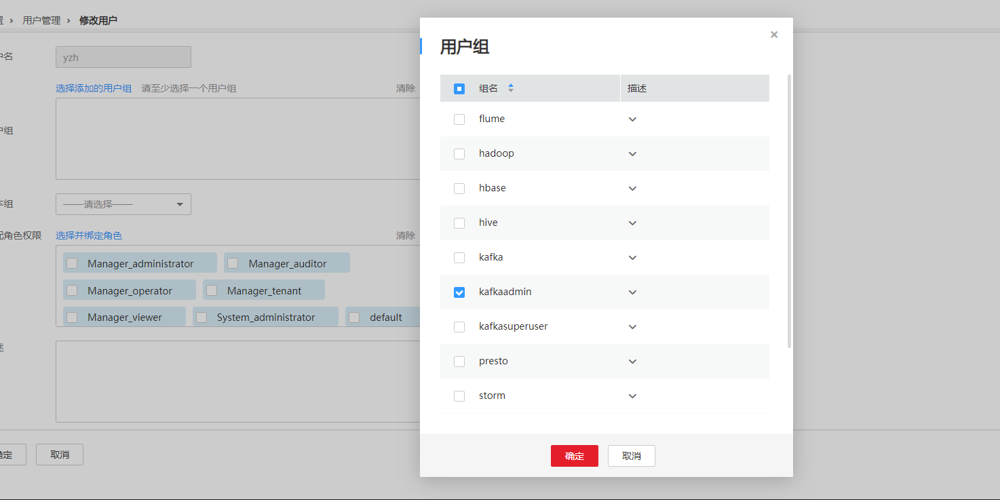

# 执行Kafka Topic删除操作，提示AdminOperationException<a name="mrs_03_0120"></a>

## 问题背景与现象<a name="zh-cn_topic_0167274904_s5d135719deec4560b99adb07a0aa6416"></a>

在使用Kafka客户端命令设置Topic ACL权限时，发现Topic无法被设置。

```
kafka-topics.sh --delete --topic test4 --zookeeper 10.5.144.2:2181/kafka
```

提示错误ERROR kafka.admin.AdminOperationException: Error while deleting topic test4。

具体如下：

```
Error while executing topic command : Error while deleting topic test4
[2017-01-25 14:00:20,750] ERROR kafka.admin.AdminOperationException: Error while deleting topic test4
at kafka.admin.TopicCommand$$anonfun$deleteTopic$1.apply(TopicCommand.scala:177)
at kafka.admin.TopicCommand$$anonfun$deleteTopic$1.apply(TopicCommand.scala:162)
at scala.collection.mutable.ResizableArray$class.foreach(ResizableArray.scala:59)
at scala.collection.mutable.ArrayBuffer.foreach(ArrayBuffer.scala:47)
at kafka.admin.TopicCommand$.deleteTopic(TopicCommand.scala:162)
at kafka.admin.TopicCommand$.main(TopicCommand.scala:68)
at kafka.admin.TopicCommand.main(TopicCommand.scala)
 (kafka.admin.TopicCommand$)
```

## 可能原因<a name="zh-cn_topic_0167274904_s8efdc02bbb1a42cba8fa3e43e2e68817"></a>

用户不属于**kafkaadmin**组，Kafka提供安全访问接口，kafkaamdin组用户才可以进行topic删除操作。

## 原因分析<a name="zh-cn_topic_0167274904_section10342981143649"></a>

1.  使用客户端命令，打印AdminOperationException异常。
2.  通过客户端命令**klist**查询当前认证用户：

    ```
    [root@10-10-144-2 client]# klist
    Ticket cache: FILE:/tmp/krb5cc_0
    Default principal: test@HADOOP.COM
    
    Valid starting     Expires            Service principal
    01/25/17 11:06:48  01/26/17 11:06:45  krbtgt/HADOOP.COM@HADOOP.COM
    ```

    如上例中当前认证用户为test。

3.  通过命令**id**查询用户组信息

    ```
    [root@10-10-144-2 client]# id test
    uid=20032(test) gid=10001(hadoop) groups=10001(hadoop),9998(ficommon),10003(kafka)
    ```


## 解决办法<a name="zh-cn_topic_0167274904_s2d3c010d3bc0406fa3f531ccd76c297f"></a>

MRS Manager界面操作：

1.  登录MRS Manager。
2.  选择“系统设置 \> 用户管理”。
3.  在操作用户对应的“操作”列，单击“修改”。
4.  为用户加入**kafkaadmin**组。单击“确定”完成修改操作。

    **图 1**  修改用户信息<a name="zh-cn_topic_0167274904_fig65541556172518"></a>  
    

5.  通过命令**id**查询用户组信息。

    ```
    [root@10-10-144-2 client]# id test
    uid=20032(test) gid=10001(hadoop) groups=10001(hadoop),9998(ficommon),10002(kafkaadmin)，10003(kafka)
    ```


FusionInsight Manager界面操作：

1.  登录FusionInsight Manager。
2.  选择“系统 \> 权限 \> 用户”。
3.  在使用的用户所在行的单击“修改”。
4.  为用户添加**kafkaadmin**组。单击“确定”完成修改操作。
5.  通过命令**id**查询用户组信息。

    ```
    [root@10-10-144-2 client]# id test
    uid=20032(test) gid=10001(hadoop) groups=10001(hadoop),9998(ficommon),10002(kafkaadmin)，10003(kafka)
    ```


