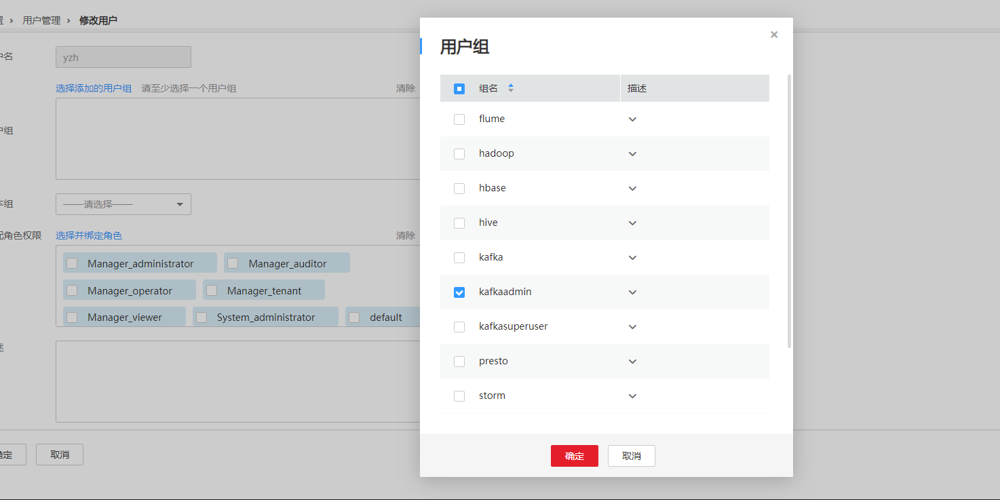

# 执行Kafka Topic设置ACL操作失败，提示NoAuthException<a name="ZH-CN_TOPIC_0185002837"></a>

## 问题背景与现象<a name="zh-cn_topic_0167275006_s5d135719deec4560b99adb07a0aa6416"></a>

在使用Kafka客户端命令设置Topic ACL权限时，发现Topic无法被设置。

```
kafka-acls.sh --authorizer-properties zookeeper.connect=10.5.144.2:2181/kafka  --topic topic_acl --producer --add --allow-principal User:test_acl
```

提示错误NoAuthException: KeeperErrorCode = NoAuth for /kafka-acl-changes/acl\_changes\_0000000002。

具体如下：

```
Error while executing ACL command: org.apache.zookeeper.KeeperException$NoAuthException: KeeperErrorCode = NoAuth for /kafka-acl-changes/acl_changes_0000000002
org.I0Itec.zkclient.exception.ZkException: org.apache.zookeeper.KeeperException$NoAuthException: KeeperErrorCode = NoAuth for /kafka-acl-changes/acl_changes_0000000002
at org.I0Itec.zkclient.exception.ZkException.create(ZkException.java:68)
at org.I0Itec.zkclient.ZkClient.retryUntilConnected(ZkClient.java:995)
at org.I0Itec.zkclient.ZkClient.delete(ZkClient.java:1038)
at kafka.utils.ZkUtils.deletePath(ZkUtils.scala:499)
at kafka.common.ZkNodeChangeNotificationListener$$anonfun$purgeObsoleteNotifications$1.apply(ZkNodeChangeNotificationListener.scala:118)
at kafka.common.ZkNodeChangeNotificationListener$$anonfun$purgeObsoleteNotifications$1.apply(ZkNodeChangeNotificationListener.scala:112)
at scala.collection.mutable.ResizableArray$class.foreach(ResizableArray.scala:59)
at scala.collection.mutable.ArrayBuffer.foreach(ArrayBuffer.scala:47)
at kafka.common.ZkNodeChangeNotificationListener.purgeObsoleteNotifications(ZkNodeChangeNotificationListener.scala:112)
at kafka.common.ZkNodeChangeNotificationListener.kafka$common$ZkNodeChangeNotificationListener$$processNotifications(ZkNodeChangeNotificationListener.scala:97)
at kafka.common.ZkNodeChangeNotificationListener.processAllNotifications(ZkNodeChangeNotificationListener.scala:77)
at kafka.common.ZkNodeChangeNotificationListener.init(ZkNodeChangeNotificationListener.scala:65)
at kafka.security.auth.SimpleAclAuthorizer.configure(SimpleAclAuthorizer.scala:136)
at kafka.admin.AclCommand$.withAuthorizer(AclCommand.scala:73)
at kafka.admin.AclCommand$.addAcl(AclCommand.scala:80)
at kafka.admin.AclCommand$.main(AclCommand.scala:48)
at kafka.admin.AclCommand.main(AclCommand.scala)
Caused by: org.apache.zookeeper.KeeperException$NoAuthException: KeeperErrorCode = NoAuth for /kafka-acl-changes/acl_changes_0000000002
at org.apache.zookeeper.KeeperException.create(KeeperException.java:117)
at org.apache.zookeeper.KeeperException.create(KeeperException.java:51)
at org.apache.zookeeper.ZooKeeper.delete(ZooKeeper.java:1416)
at org.I0Itec.zkclient.ZkConnection.delete(ZkConnection.java:104)
at org.I0Itec.zkclient.ZkClient$11.call(ZkClient.java:1042)
at org.I0Itec.zkclient.ZkClient.retryUntilConnected(ZkClient.java:985)
```

## 可能原因<a name="zh-cn_topic_0167275006_s8efdc02bbb1a42cba8fa3e43e2e68817"></a>

用户不属于**kafkaadmin**组，Kafka提供安全访问接口，**kafkaamdin**组用户才可以进行设置操作。

## 原因分析<a name="zh-cn_topic_0167275006_section10342981143649"></a>

1.  使用客户端命令，打印NoAuthException异常。
2.  通过客户端命令**klist**查询当前认证用户：

    ```
    [root@10-10-144-2 client]# klist
    Ticket cache: FILE:/tmp/krb5cc_0
    Default principal: test@HADOOP.COM
    
    Valid starting     Expires            Service principal
    01/25/17 11:06:48  01/26/17 11:06:45  krbtgt/HADOOP.COM@HADOOP.COM
    ```

    如上例中当前认证用户为**test**。

3.  通过命令**id**查询用户组信息。

    ```
    [root@10-10-144-2 client]# id test
    uid=20032(test) gid=10001(hadoop) groups=10001(hadoop),9998(ficommon),10003(kafka)
    ```


## 解决办法<a name="zh-cn_topic_0167275006_s2d3c010d3bc0406fa3f531ccd76c297f"></a>

1.  登录MRS Manager。
2.  选择“系统设置 \> 用户管理”。
3.  在操作用户对应的“操作”列，单击“修改”。
4.  为用户加入**kafkaadmin**组。

    **图 1**  修改用户组<a name="zh-cn_topic_0167275006_fig65541556172518"></a>  
    

5.  通过命令**id**查询用户组信息。

    ```
    [root@host1 client]# id test
    uid=20032(test) gid=10001(hadoop) groups=10001(hadoop),9998(ficommon),10002(kafkaadmin)，10003(kafka)
    ```


