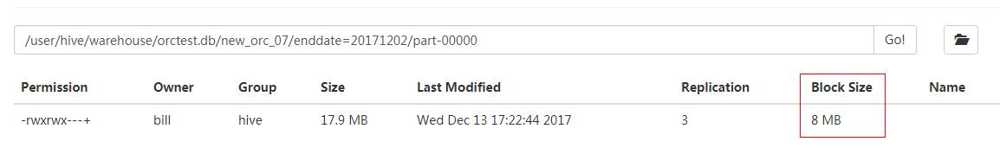
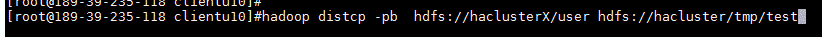

# 执行balance失败，Source and target differ in block-size<a name="ZH-CN_TOPIC_0181713170"></a>

## 问题背景与现象<a name="zh-cn_topic_0167275542_sd1dc17fee2214ed9867d242a14f38d7d"></a>

执行distcp跨集群拷贝文件时，出现部分文件拷贝失败“ Source and target differ in block-size. Use -pb to preserve block-sizes during copy. ”

```
 Caused by: java.io.IOException: Check-sum mismatch between hdfs://10.180.144.7:25000/kylin/kylin_default_instance_prod/parquet/f2e72874-f01c-45ff-b219-207f3a5b3fcb/c769cd2d-575a-4459-837b-a19dd7b20c27/339114721280/0.parquettar and hdfs://10.180.180.194:25000/kylin/kylin_default_instance_prod/parquet/f2e72874-f01c-45ff-b219-207f3a5b3fcb/.distcp.tmp.attempt_1523424430246_0004_m_000019_2. Source and target differ in block-size. Use -pb to preserve block-sizes during copy. Alternatively, skip checksum-checks altogether, using -skipCrc. (NOTE: By skipping checksums, one runs the risk of masking data-corruption during file-transfer.)        at org.apache.hadoop.tools.mapred.RetriableFileCopyCommand.compareCheckSums(RetriableFileCopyCommand.java:214)

```

## 可能原因<a name="zh-cn_topic_0167275542_sf4a7e0ba1ac14d3cb1db306143d1b51c"></a>

distcp默认拷贝文件时不记录原block大小导致在原文件block.size不是128M时校验失败，需要在distcp命令增加-pb参数。

## 原因分析<a name="zh-cn_topic_0167275542_s36d0a1c802044398ada37b44f5dced4e"></a>

1.  HDFS在写的时候有设置块大小，默认128M，某些组件或者业务程序写入的文件可能不是128M，如8M。

    ```
    <name>dfs.blocksize</name>
    <value>134217728</value>
    ```

    **图 1**  某些组件或者业务程序写入的文件大小<a name="zh-cn_topic_0167275542_fig751017595549"></a>  
    

2.  distcp 从源集群读文件后写入新集群，默认是使用的MapReduce任务中的dfs.blocksize，默认128M。
3.  在distcp写完文件后，会基于块的物理大小做校验，因为该文件在新旧集群中block.size不一致，因此拆分大小不一致，导致校验失败。

    如以上文件，在旧集群是17.9/8MB = 3个block， 在新集群  17.9/128M = 1个block. 因此实际在磁盘的物理大小因分割而导致校验失败。


## 解决办法<a name="zh-cn_topic_0167275542_section236175334913"></a>

distcp时，增加**-pb**参数。该参数作用为distcp时候保留block大小，确保新集群写入文件blocksize和老集群一致。

**图 2**  distcp时保留block大小<a name="zh-cn_topic_0167275542_fig446912441560"></a>  


