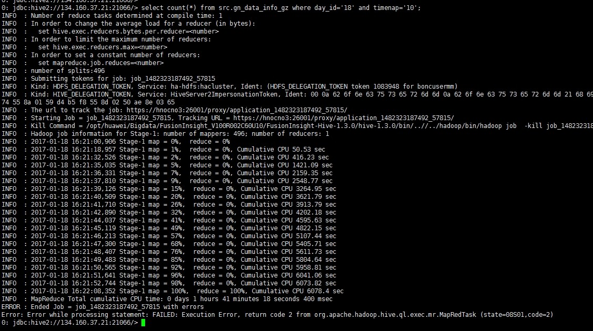
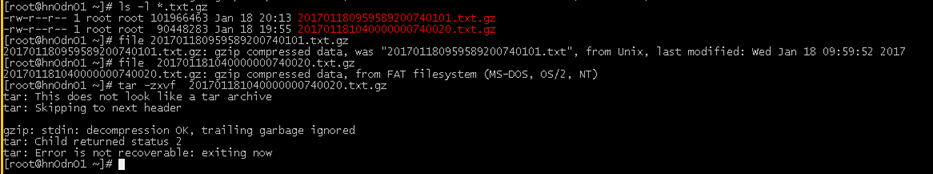

# 执行select语句报错

## 问题现象

执行语句select count\(\*\) from XXX;时客户端报错：Error:Error while processing statement :FAILED:Execution Error,return code 2 from ...

这个报错return code2说明是在执行mapreduce任务期间报错导致任务失败。

## 原因分析

1.  进入yarn原生页面查看mapreduce任务的日志看到报错是无法识别到压缩方式导致错误，看文件后缀是gzip压缩，堆栈却报出是zlib方式。

    

2.  因此怀疑此语句查询的表对应的HDFS上的文件有问题，map日志中打印出了解析的对应的文件名，将其从HDFS上下载到本地，看到是gz结尾的文件，使用**tar**命令解压报错，格式不正确无法解压。使用file命令查看文件属性发现此文件来自于FAT系统的压缩而非unix。

    

## 解决办法

将格式不正确的文件移除hdfs目录或者替换为正确的格式的文件。

