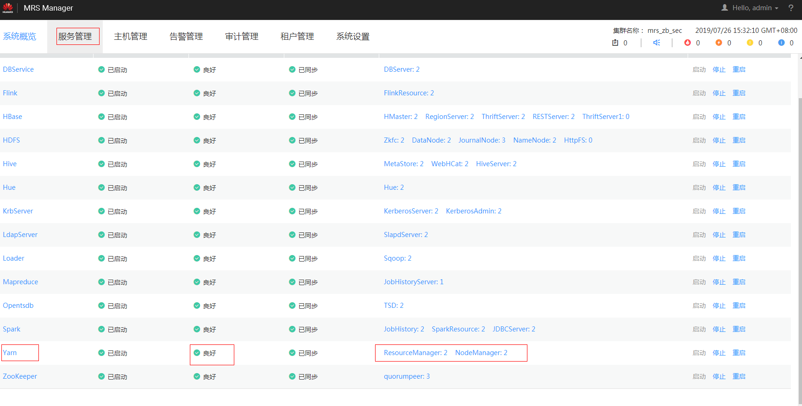

# 提交Spark任务时，连接ResourceManager异常<a name="mrs_03_0131"></a>

## 问题背景与现象<a name="zh-cn_topic_0167275589_sb20f31b2fbde41d88c1b10c6459ac320"></a>

连接ResourceManager异常，导致Spark任务提交失败。

## 原因分析<a name="zh-cn_topic_0167275589_s6b1473af339041d2a48fdd57e9038aa7"></a>

1.  在driver端打印异常如下，打印连接两个ResourceManager主备节点的26004端口均被拒绝：

    ```
    15/08/19 18:36:16 INFO RetryInvocationHandler: Exception while invoking getClusterMetrics of class ApplicationClientProtocolPBClientImpl over 33 after 1 fail over attempts. Trying to fail over after sleeping for 17448ms. 
     java.net.ConnectException: Call From ip0 to ip1:26004 failed on connection exception: java.net.ConnectException: Connection refused.
    INFO RetryInvocationHandler: Exception while invoking getClusterMetrics of class ApplicationClientProtocolPBClientImpl over 32 after 2 fail over attempts. Trying to fail over after sleeping for 16233ms. 
     java.net.ConnectException: Call From ip0 to ip2:26004 failed on connection exception: java.net.ConnectException: Connection refused;
    ```

2.  在MRS Manager页面查看ResourceManager此时是否功能正常，如[图1](#zh-cn_topic_0167275589_fig10342185215614)所示，如果Yarn状态故障或某个yarn服务的实例出现未知之类的异常说明此时集群的RM可能异常。

    **图 1**  服务状态<a name="zh-cn_topic_0167275589_fig10342185215614"></a>  
    

3.  排查使用的客户端是否是集群最新的客户端。

    排查集群是否做过实例RM迁移相关操作（先卸载某个RM实例，然后在其他节点添加回来）。

4.  在MRS Manager页面单击“审计管理“，查看审计日志，是否有相关操作的记录。

    使用**ping**命令，查看IP是否可联通。


## 解决办法<a name="zh-cn_topic_0167275589_s87cdd955a4de4e7eb3f75a653c869647"></a>

-   如果RM出现异常，可参考Yarn相关章节查看解决方法。
-   如果客户端不是最新，请重新下载客户端。
-   若使用**ping**命令查看IP不通，需要协调网络管理相关人员协助排查网络。

