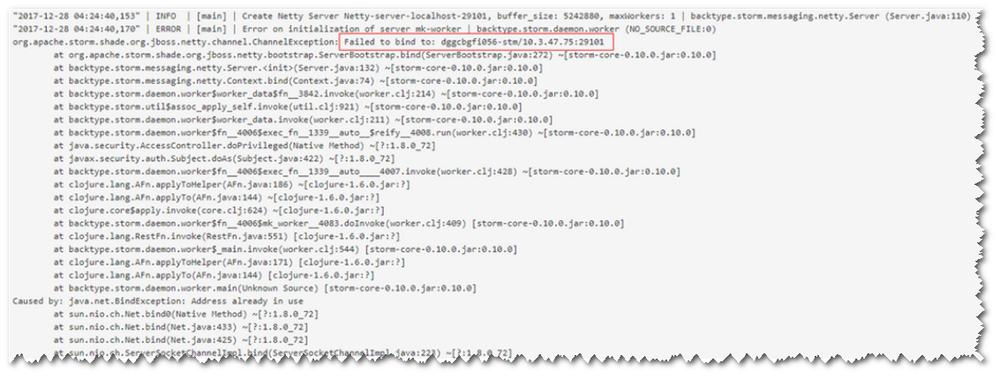
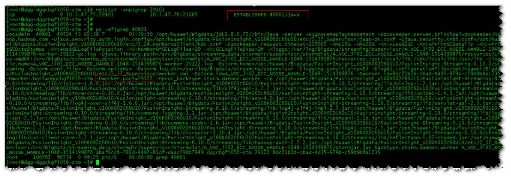
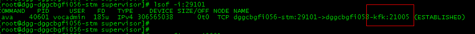
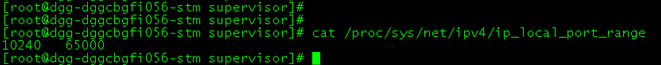

# 提交拓扑后Worker运行异常，日志提示Failed to bind to：host:ip<a name="mrs_03_0099"></a>

## 现象描述<a name="zh-cn_topic_0167274574_sd2de281c3a2e46329e3c488c1b54fd23"></a>

提交业务拓扑后，发现Worker无法正常启动。查看Worker日志，日志提示Failed to bind to：host:ip。



## 可能原因<a name="zh-cn_topic_0167274574_s857ea6f1c1e445dab07996a583d322cd"></a>

随机端口范围配置错误。

## 定位思路<a name="zh-cn_topic_0167274574_s08977f806d574ddc92c4b3a9e9f62513"></a>

1、检查worker相关信息日志。

2、检查绑定端口的进程信息。

3、检查随机端口范围配置。

## 原因分析<a name="zh-cn_topic_0167274574_section376866152110"></a>

1.  通过SSH登录Worker启动失败主机，通过**netstat -anp | grep <port\>**命令，查看占用端口的进程ID信息。其中port修改为实际端口号。
2.  通过**ps -ef | grep <pid\>**命令查看进程的详细信息，其中pid为查询出的实际进程ID。

    

    发现占用端口的进程为worker进程，该进程为另一个拓扑业务进程。同时根据进程详细信息发现，分配给该进程的端口为29122。

3.  通过**lsof -i:<port\>**命令**，**查看连接详细信息。其中port为实际端口号。

    

    发现29101端口连接对端端口为21005，而21005为Kafka服务端端口。

    说明业务层作为客户端连接Kafka获取消息，业务端口分配通过OS的随机端口分配范围来确定。

4.  通过**cat /proc/sys/net/ipv4/ip\_local\_port\_range**命令查看随机端口范围。

    

5.  发现随机端口范围过大，和MRS的服务端口范围存在冲突。

    > **说明：** 
    >MRS的服务端口范围：20000-30000。


## 处理步骤<a name="zh-cn_topic_0167274574_section362416245349"></a>

1.  修改随机端口范围。

    ```
    vi /proc/sys/net/ipv4/ip_local_port_range
    32768 61000
    ```

2.  停止占用服务端口的业务进程，释放端口。（停止业务拓扑）

