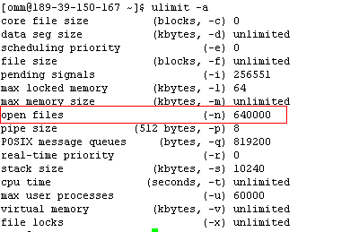
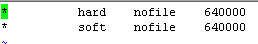

# 文件最大打开句柄数设置太小导致读写文件异常<a name="ZH-CN_TOPIC_0181713161"></a>

## 问题背景与现象<a name="zh-cn_topic_0167274824_s17abfc85203d46d49c2198b46fbb9056"></a>

文件最大打开句柄数设置太小，导致文件句柄不足。写文件到HDFS很慢，或者写文件失败。

## 原因分析<a name="zh-cn_topic_0167274824_sb76c1129bcae439a966c320b8c7a25e1"></a>

1.  DataNode日志“/var/log/Bigdata/hdfs/dn/hadoop-omm-datanode-XXX.log“，存在异常提示java.io.IOException: Too many open files。

    ```
    2016-05-19 17:18:59,126 | WARN  | org.apache.hadoop.hdfs.server.datanode.DataXceiverServer@142ff9fa | YSDN12:25009:DataXceiverServer:  | org.apache.hadoop.hdfs.server.datanode.DataXceiverServer.run(DataXceiverServer.java:160)
    java.io.IOException: Too many open files
    at sun.nio.ch.ServerSocketChannelImpl.accept0(Native Method)
    at sun.nio.ch.ServerSocketChannelImpl.accept(ServerSocketChannelImpl.java:241)
    at sun.nio.ch.ServerSocketAdaptor.accept(ServerSocketAdaptor.java:100)
    at org.apache.hadoop.hdfs.net.TcpPeerServer.accept(TcpPeerServer.java:134)
    at org.apache.hadoop.hdfs.server.datanode.DataXceiverServer.run(DataXceiverServer.java:137)
    at java.lang.Thread.run(Thread.java:745)
    ```

2.  如果某个DataNode日志中打印“Too many open files”，说明该节点文件句柄不足，导致打开文件句柄失败，然后就会重试往其他DataNode节点写数据，最终表现为写文件很慢或者写文件失败。

## 解决办法<a name="zh-cn_topic_0167274824_s710278da7b2445acb80cf9df277a3e3b"></a>

1.  执行**ulimit -a**命令查看有问题节点文件句柄数最多设置是多少，如果很小，建议修改成640000。

    **图 1**  查看文件句柄数<a name="zh-cn_topic_0167274824_fig12692149123315"></a>  
    

2.  执行**vi /etc/security/limits.d/90-nofile.conf**命令编辑这个文件，修改文件句柄数设置。如果没有这个文件，可以新建一个文件，并按照下图内容修改。

    **图 2**  修改文件句柄数<a name="zh-cn_topic_0167274824_fig15464132415338"></a>  
    

3.  重新打开一个终端窗口，用**ulimit -a**命令查看是否修改成功，如果没有，请重新按照上述步骤重新修改。
4.  从MRS Manager页面重启DataNode实例。

