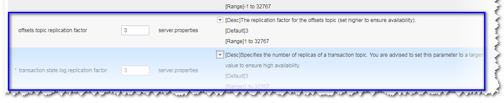

# 新建集群Consumer消费数据失败，提示GROUP\_COORDINATOR\_NOT\_AVAILABLE<a name="mrs_03_0102"></a>

## 问题背景与现象<a name="zh-cn_topic_0167275482_section3945184441312"></a>

新建Kafka集群，部署Broker节点数为2，使用Kafka客户端可以正常生产，但是无法正常消费。Consumer消费数据失败，提示GROUP\_COORDINATOR\_NOT\_AVAILABLE，关键日志如下：

```
2018-05-12 10:58:42,561 | INFO | [kafka-request-handler-3] | [GroupCoordinator 2]: Preparing to restabilize group DemoConsumer with old generation 118 | kafka.coordinator.GroupCoordinator (Logging.scala:68)
2018-05-12 10:59:13,562 | INFO | [executor-Heartbeat] | [GroupCoordinator 2]: Preparing to restabilize group DemoConsumer with old generation 119 | kafka.coordinator.GroupCoordinator (Logging.scala:68)
```

## 可能原因<a name="zh-cn_topic_0167275482_section116511152013"></a>

\_\_consumer\_offsets无法创建。

## 原因分析<a name="zh-cn_topic_0167275482_section19940122851412"></a>

1.  查看日志，发现大量\_\_consumer\_offset创建异常。
2.  查看集群发现当前Broker数量为2。

1.  查看\_\_cosumer\_offset topic要求副本为3，因此创建失败。

    


## 解决办法<a name="zh-cn_topic_0167275482_section103311642181412"></a>

可以将扩容至至少3个流式core节点，或参考如下步骤修改服务配置参数。

1.  进入服务参数配置界面。
    -   MRS Manager界面操作：登录MRS Manager，选择“服务管理 \> Kafka \> 服务配置”，“参数类别”设置为“全部配置”。
    -   FusionInsight Manager界面操作：登录FusionInsight Manager。选择“集群 \> 服务 \> Kafka”，单击“配置”，选择“全部配置”。

2.  搜索并修改offsets.topic.replication.factor和transaction.state.log.replication.factor的值为2。
3.  保存配置，勾选“重新启动受影响的服务或实例。”并单击“确定”重启服务。

