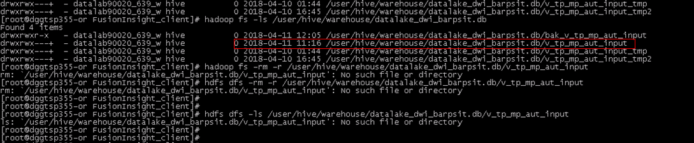
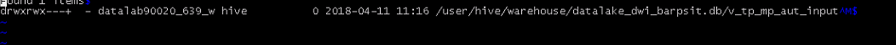
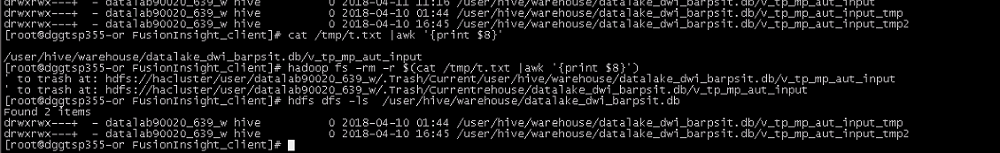

# 查询或者删除文件失败，父目录可以看见此文件（不可见字符）

## 问题背景与现象

使用HDFS的shell客户端查询或者删除文件失败，父目录可以看见此文件。

**图 1**  父目录文件列表  

## 原因分析

可能是该文件写入时有异常，写入了不可见字符。可以将该文件名重定向写入本地文本中，使用**vi**命令打开。

**hdfs dfs -ls   **_父目录_**  \>   /tmp/t.txt**

**vi /tmp/t.txt**

然后输入命令“**:set list**”将文件名的不可见字符显示出来。如这里显示出文件名中包含“**^M**”不可见字符。

**图 2**  显示不可见字符  

## 解决办法

1.  使用shell命令读到文本中记录的该文件名，确认如下命令输出的是该文件在HDFS中的全路径。

    **cat /tmp/t.txt |awk '\{print $8\}'**

    **图 3**  文件路径  
    

2.  使用如下命令删除该文件。

    **hdfs dfs -rm $\(cat /tmp/t.txt |awk '\{print $8\}'\)**

3.  查看确认该文件已被删除。

    **hdfs dfs -ls   **_父目录_

