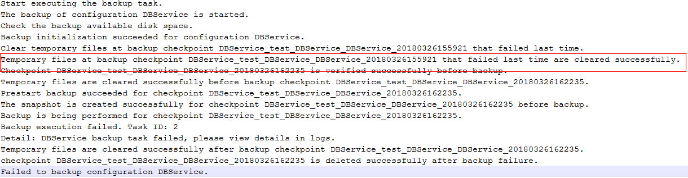

# 浮动IP不通导致DBService备份失败<a name="ZH-CN_TOPIC_0185002832"></a>

## 问题背景与现象<a name="zh-cn_topic_0167274756_sd64242caa665405798481482f49ab0ee"></a>

在默认备份default中DBService备份失败，其他备份（NameNode、LdapServer、OMS备份）成功。

## 原因分析<a name="zh-cn_topic_0167274756_s4871ca6d7a6b47b1a0f8266b84631f32"></a>

1.  查看DBService的备份页面错误信息，有如下错误信息提示：

    ```
    Clear temporary files at backup checkpoint DBService_test_DBService_DBService_20180326155921 that fialed last time.
    Temporyary files at backup checkpoint DBService_test_DBService_DBService20180326155921 that failed last time are cleared successfully.
    ```

    

2.  查看/var/log/Bigdata/dbservice/scriptlog/backup.log文件，发现日志停止打印，并没有备份相关信息。
3.  查看主OMS节点 /var/log/Bigdata/controller/backupplugin.log日志发现如下错误信息：

    ```
    result error is ssh:connect to host 172.16.4.200 port 22 : Connection refused (172.16.4.200是DBService的浮动IP)
    DBService backup failed.
    ```

    


## 解决办法<a name="zh-cn_topic_0167274756_section208703200573"></a>

1.  登录DBService主节点（绑定有DBService浮动IP的master节点）。

    

2.  检查 /etc/ssh/sshd\_config文件中ListenAddress，添加DBService浮动IP到ListenAdress或者注释掉ListenAdress。
3.  执行如下命令重启sshd服务。

    **service sshd restart**

4.  观察下次备份DBServie是否备份成功。

