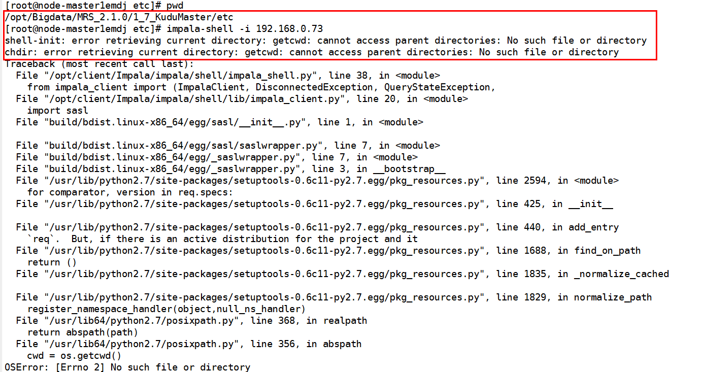

# 用户连接impala-shell失败

## 用户问题

用户连接impala-shell失败。

## 问题现象

用户在“组件管理”页面修改任意组件的配置并重启服务后，连接impala-shell，会出现连接失败，报错no such file/directory。

## 原因分析

修改服务配置并重启服务后，部分服务的目录结构会删除并重新创建，如服务的etc目录等。如果重启服务前所在的目录为etc或者其子目录，由于重启后目录重建，仍在原来目录执行impala-shell时会产生某些系统变量或者参数无法找到的情况，所以连接impala-shell连接失败。

## 处理步骤

任意切换到存在的目录，重新连接impala-shell即可。

