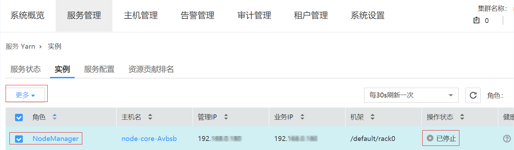
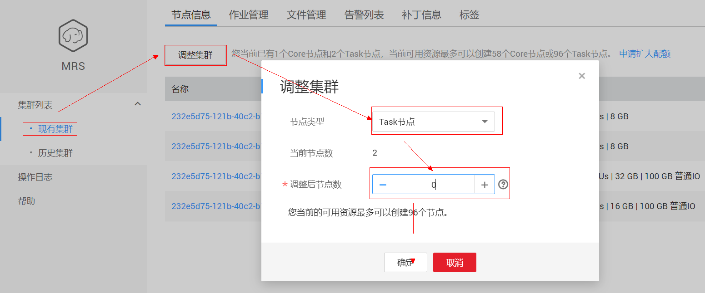

# 缩容Task节点失败

## 用户问题

客户在MRS集群详情界面执行调整集群，将Task节点调整成0个，最终缩容失败。

## 问题现象

客户在MRS集群详情页面调整集群Task节点，最终缩容失败，提示“This operation is not allowed because the number of instances of NodeManager will be less than the minimum configuration after scale-in, which may cause data loss.”

## 原因分析

客户将Core节点的NodeManager服务停止了，导致在检查Task节点退服过程中发现Task如果全部退订，则将没有NodeManager，则Yarn服务就不可用，而MRS判断剩余的NodeManger必须大于等于1才能退服Task节点。

## 处理步骤

1.  登录MRS集群页面，在“现有集群“中，单击对应的集群名称，进入集群详情页面。
2.  单击“集群管理页面“后的“点击查看“，登录到MRS Manager页面。
3.  在MRS Manager页面，选择“服务管理“-\>“Yarn“服务-\>“实例“。
4.  启动Core节点的NodeManager。

    

5.  然后在集群列表页面退服Task节点。等退服成功后，若不想用Core节点的NodeManager再将其停止。

    

## 建议与总结

Core节点的NodeManager通常不会将其停止，客户不要随意变更集群部署结构。

