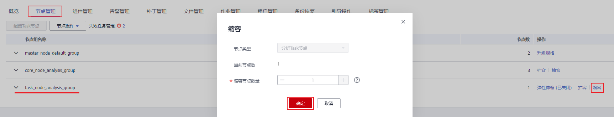

# 缩容Task节点失败

## 用户问题

客户在MRS 2.x集群详情界面执行调整集群，将Task节点调整成0个，最终缩容失败。

## 问题现象

客户在MRS集群详情页面调整集群Task节点，最终缩容失败，提示“This operation is not allowed because the number of instances of NodeManager will be less than the minimum configuration after scale-in, which may cause data loss.”

## 原因分析

客户将Core节点的NodeManager服务停止了，导致在检查Task节点退服过程中发现Task如果全部退订，则将没有NodeManager，则Yarn服务就不可用，而MRS判断剩余的NodeManger必须大于等于1才能退服Task节点。

## 处理步骤

1.  进入Yarn服务实例页面：
    -   MRS 1.8.10及之前版本，登录MRS Manager页面，具体请参见[访问MRS Manager](https://support.huaweicloud.com/usermanual-mrs/mrs_01_0102.html)，然后选择“服务管理 \>Yarn \> 实例”。
    -   MRS 1.8.10之后及2._x_版本，单击集群名称，登录集群详情页面，选择“组件管理 \> Yarn \> 实例”。

        > **说明：** 
        >若集群详情页面没有“组件管理”页签，请先完成IAM用户同步（在集群详情页的“概览”页签，单击“IAM用户同步“右侧的“同步”进行IAM用户同步）。

    -   MRS 3.x及后续版本，登录FusionInsight Manager。然后选择“集群 \>  _待操作的集群名_称 \> 服务 \> Yarn \> 实例”。

2.  勾选Core节点的NodeManager实例，选择“更多 \> 启动实例”。

    

3.  在集群列表页面缩容Task节点。
    1.  单击集群名称进入集群详情页面，选择“节点管理”。
    2.  在Task节点组所在行的“操作”列单击“缩容”。

        **图 1**  缩容Task  
        

    3.  单击“确定”并在弹出框选择“是”。

4.  等缩容成功后，若不想用Core节点的NodeManager再将其停止。

## 建议与总结

Core节点的NodeManager通常不会将其停止，客户不要随意变更集群部署结构。

