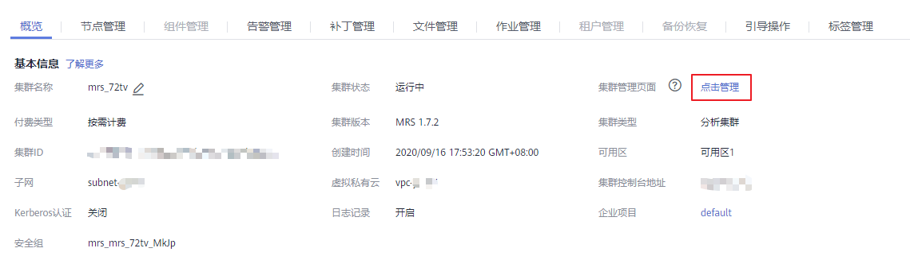
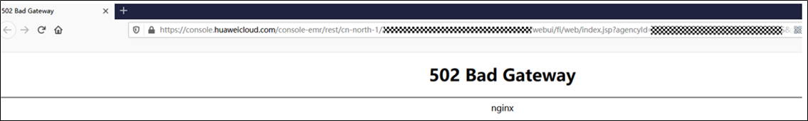
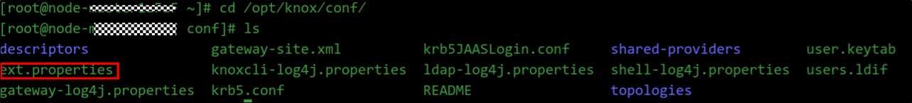
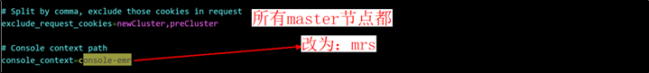

# 访问MRS Manager页面报错502

## 用户问题

访问“集群管理页面”地址打开显示502错误，如何修复？

## 问题现象

MRS 1.7.2未开启Kerberos认证的普通集群，访问MRS Manager页面报错如下图：

**图 1**  访问MRS Manager  

**图 2**  MRS Manager页面报错  

## 原因分析

由于MRS的域名由console-emr变更为mrs 导致MRS 1.8.0之前的普通集群访问MRS Manager的链接有误。

## 处理步骤

1.  以root用户登录到所有Master节点。
2.  进入**/opt/knox/conf/**目录，找到ext.properties文件。

    

3.  修改所有Master节点中的ext.properties配置中的“console-emr”为 “mrs”。

    

4.  进入**/opt/knox/bin/**  目录，并执行**su - omm**命令切换到 omm 用户。
5.  执行脚本**restart-knox.sh**  重启knox 服务。
6.  再次访问MRS Manager页面即可正常跳转。

