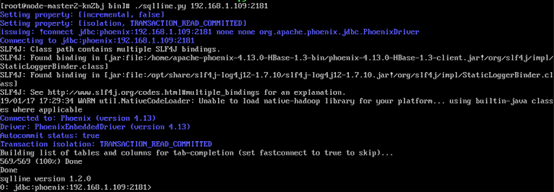

# 连接到HBase响应慢

## 用户问题

在相同的vpc网络下，外部集群通过Phoenix连接到HBase响应慢。

## 问题现象

在相同的vpc下，外部集群通过Phoenix连接到HBase时，响应太慢。

## 原因分析

客户配置了DNS服务，由于客户端连接到HBase先通过DNS来解析服务器端，所以导致响应慢。

## 处理步骤

1.  以root用户登录Master节点。
2.  执行**vi /etc/resolv.conf**，打开resolv.conf文件，注释掉DNS服务器地址。例如，\#1.1.1.1

