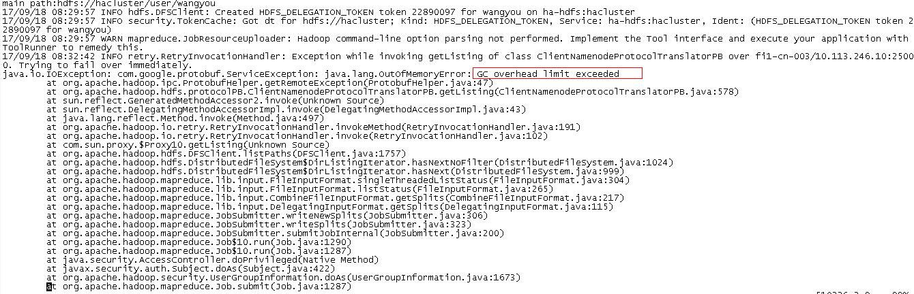
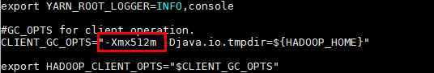

# 通过客户端hadoop jar命令提交任务，客户端返回GC overhead

## 问题背景与现象

通过客户端提交任务，客户端返回内存溢出的报错结果:

## 原因分析

从报错堆栈可以看出是任务在提交过程中分片时在读取HDFS文件阶段内存溢出了，一般是由于该任务要读取的小文件很多导致内存不足。

## 解决办法

1.  排查启动的MR任务是否对应的HDFS文件个数很多，如果很多，减少文件数量，提前先合并小文件或者尝试使用combineInputFormat来减少任务读取的文件数量。
2.  增大hadoop命令执行时的内存，该内存在客户端中设置，修改对应路径“_客户端安装目录_/HDFS/component\_env”文件中“CLIENT\_GC\_OPTS”的“-Xmx”参数，将该参数的默认值改大，比如改为512m。然后执行**source component\_env**命令，使修改的参数生效。

    

