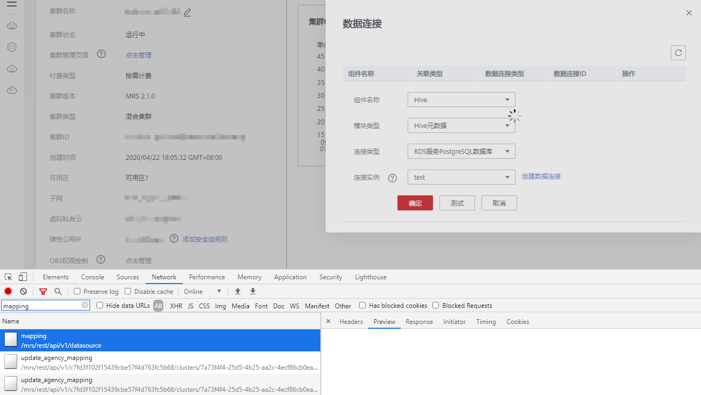
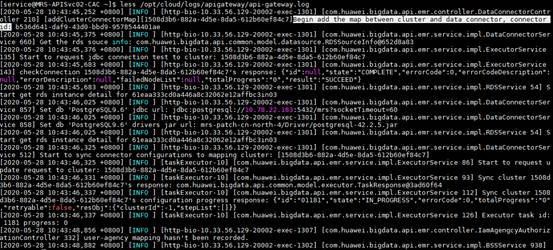
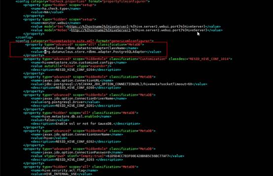
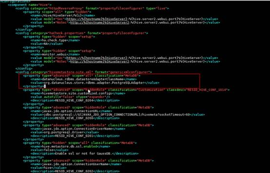
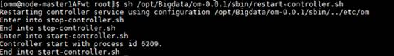
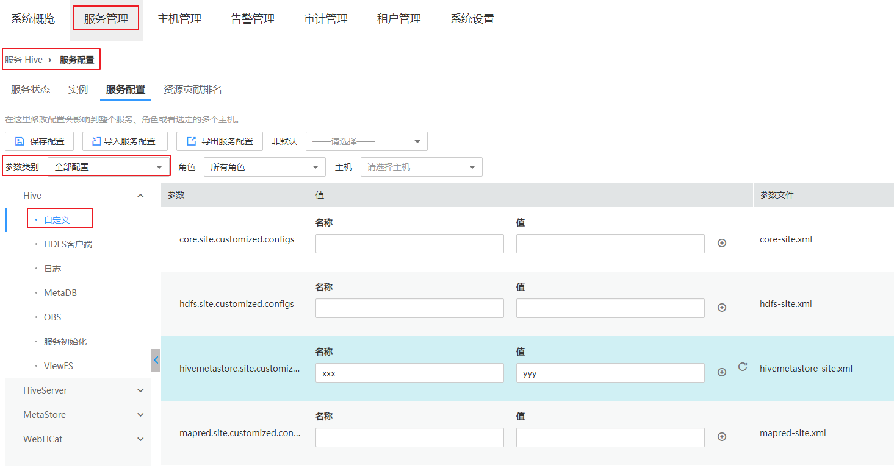
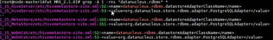
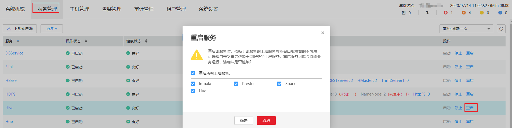

# 配置数据连接超时<a name="mrs_03_0224"></a>

## 用户问题<a name="section20359456497"></a>

配置数据连接时接口超时。



## 问题现象<a name="section1030411239158"></a>

配置数据连接时调用接口：POST /api-gateway/api/v1/datasource/mapping超时，登录到API-getway后台查看tomcat日志看到接口返回500，APIGW日志无报错。

**图 1**  tomcat日志<a name="fig66989042617"></a>  


**图 2**  APIGW日志<a name="fig1358554810259"></a>  


## 原因分析<a name="section12315617283"></a>

Hive接口驱动未正确配置导致请求超时。

## 处理步骤<a name="section4407102952818"></a>

1.  分别登录到集群的主备Master节点，并切换到omm用户，打开修改如下配置文件：

    /opt/Bigdata/MRS\_2.1.0/install/FusionInsight-Hive-3.1.0/adapter/conf/controller/configurations.xml

    /opt/Bigdata/om-0.0.1/etc/components/MRS\_2.1.0_/_Hive/configurations.xml

    如上文件路径以MRS 2.1.0版本集群为例介绍，请根据自身集群版本和Hive组件版本修改如上路径。

2.  分别在两个配置文件中添加如下配置项：

    ```
    <property type="advanced" scope="all" classification="MetaDB">
    <name>datanucleus.rdbms.datastoreAdapterClassName</name>
    <value>org.datanucleus.store.rdbms.adapter.PostgreSQLAdapter</value>
    </property>
    ```

    **图 3**  /opt/Bigdata/MRS\_2.1.0/install/FusionInsight-Hive-3.1.0/adapter/conf/controller/configurations.xml文件修改<a name="fig1784027193819"></a>  
    

    **图 4**  /opt/Bigdata/om-0.0.1/etc/components/MRS\_2.1.0/Hive/configurations.xml文件修改<a name="fig1451136133813"></a>  
    

3.  在主Master节点执行如下命令重启controller服务，备Master节点无需执行该步骤。

    sh /opt/Bigdata/om-0.0.1/sbin/restart-controller.sh

    

4.  进入配置页面：

    MRS Manager界面操作：登录MRS Manager页面，选择“Hive \> 服务配置 \> 全部配置”。

    FusionInsight Manager界面操作：登录FusionInsight Manager，选择“集群 \>  _待操作集群的名称_  \> 服务 \> Hive \> 配置 \> 全部配置 ”。

5.  在自定义参数中任意添加一个参数，然后单击“保存配置”并勾选“重新启动受影响的服务或实例。”实现服务配置的更新（重启Hive会影响业务，建议在业务空闲时执行该操作）。

    

6.  分别登录到集群的主备Master节点上，然后执行如下命令确认配置修改生效。

    cd /opt/Bigdata/MRS\_2.1.0;grep -A 1 -rni "datanucleus.rdbms" \*

    

7.  在MRS服务控制台的对应集群的“概览”页单击“数据连接”右侧的“点击管理”重新配置数据连接（该RDS必须是新建且没有数据的连接）。

    

8.  参考[使用DRS迁移PostgreSQL数据](https://support.huaweicloud.com/usermanual-rds/rds_09_0022.html)将数据迁移到新建的RDS数据库。
9.  重启Hive及相关的组件。

    MRS Manager界面操作：登录MRS Manager页面，在“服务管理”页面单击Hive服务对应行“操作”列的“重启”，重启Hive及相关的组件（重启组件会影响业务，建议在业务空闲时执行重启操作）。

    

    FusionInsight Manager界面操作：登录FusionInsight Manager，选择“集群 \>  _待操作集群的名称_  \> 服务”，单击Hive服务旁的，在下拉框中选择“重启服务”，重启Hive及相关的组件（重启组件会影响业务，建议在业务空闲时执行重启操作）。


