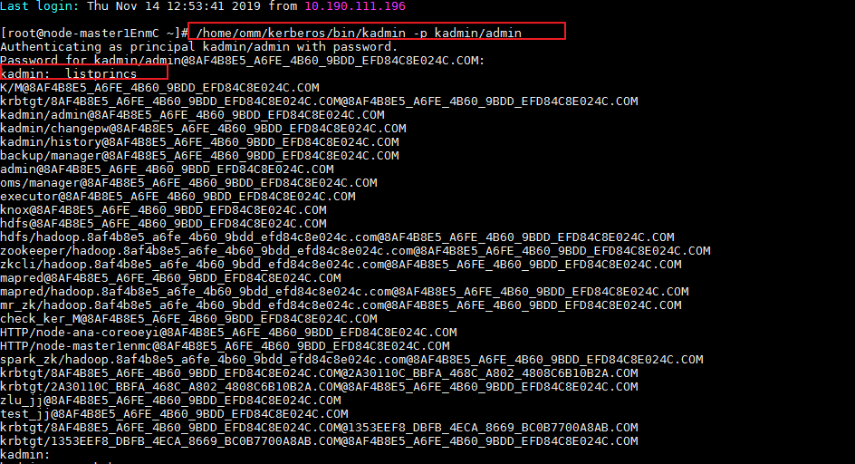
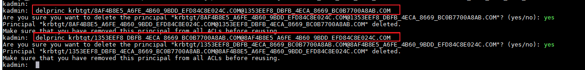

# 配置跨集群互信失败

## 问题背景与现象

MRS 1.8.2之前的版本和MRS 1.8.2及之后的版本的两个集群之间跨集群互信不通

## 原因分析

配置跨集群互信后，互信的两个集群均会增加内部用户“krbtgt/_本集群域名_@_外部集群域名_”、“krbtgt/_外部集群域名_@_本集群域名_”，MRS 1.8.2之前的版本密码默认为“Admin@123”，MRS 1.8.2及之后的版本密码默认为“Crossrealm@123”，由于两个版本集群的用户密码不一致导致跨集群互信配置失败。

## 处理步骤

-   **若未配置互信场景：**
    1.  配置互信前，登录MRS 1.8.2及之后版本的集群上的Master节点。
    2.  修改所有Master节点上的/opt/Bigdata/om-0.0.1/sbin/addRealm.sh脚本中的add\_cross\_realm\_princ方法中的**local cross\_realm\_account\_pwd="$\{DEFAULT\_CROSS\_REALM\_PWD\}"**为**local cross\_realm\_account\_pwd="$\{DEFAULT \_PWD\}"**（位于脚本的1001行）。

        > **说明：** 
        >为MRS 1.8.2及之后版本的集群上的所有Master节点执行步骤[1](#li1835116593269)\~[2](#li14575163163915)。

    3.  再参考[配置跨集群互信](https://support.huaweicloud.com/usermanual-mrs/mrs_01_0354.html)配置。
    4.  检查互信是否成功。
        -   成功，则配置结束。
        -   失败，请刷新客户端配置后再检查互信是否成功，若依然不成功请提工单处理。

-   **若已经配置互信场景：**
    1.  登录MRS 1.8.2及之后版本的集群上的Master节点。
    2.  执行**/home/omm/kerberos/bin/kadmin -p kadmin/admin**  并输入密码Kerberos客户端。
    3.  执行listprincs 并按回车，查询用户信息。

        

    4.  执行**delprinc**命令删除用户“krbtgt/_本集群域名_@_外部集群域名_”、“krbtgt/_外部集群域名_@_本集群域名_”。
    5.  使用**quit**命令退出Kerberos客户端。
    6.  修改Master节点上的/opt/Bigdata/om-0.0.1/sbin/addRealm.sh脚本中的add\_cross\_realm\_princ方法中的**local cross\_realm\_account\_pwd="$\{DEFAULT\_CROSS\_REALM\_PWD\}"**为**local cross\_realm\_account\_pwd="$\{DEFAULT \_PWD\}"**（位于脚本的1001行）。
    7.  登录MRS Manager页面，选择“服务管理”。
    8.  选择“更多 \> 同步配置”。
    9.  在弹出窗口勾选“重启配置过期的服务或实例。”，并单击“确定”，重启配置过期的服务。

        同步配置时会调用addRealm.sh脚本添加krbtgt用户。

        > **说明：** 
        >为MRS 1.8.2及之后版本的集群上的所有Master节点执行步骤[1](#li18505161116398)\~[9](#li5978096092358)。

    10. 检查互信是否成功，若依然不成功，请提工单处理。

