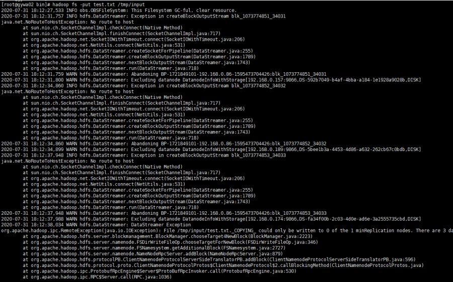

# 集群外节点安装客户端使用hdfs上传文件失败

## 用户问题

集群外节点安装客户端使用hdfs上传文件失败

## 问题现象

在集群节点上安装客户端，在该客户端使用hdfs命令上传一个文件，报如下错误：

**图 1**  上传文件报错  

## 原因分析

从错误截图可以看到报错是no route to host，且报错信息里面有192.168的ip，也即客户端节点到集群的DN节点的内网路由不通，导致上传文件失败。

## 处理步骤

在客户端节点的客户端目录下，找到HDFS的客户端配置目录hdfs-site.xml文件，在配置文件中增加配置项dfs.client.use.datanode.hostname，并将该配置设置为true。

